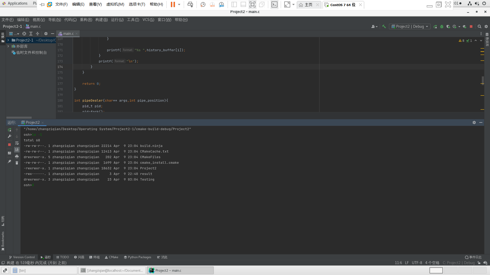
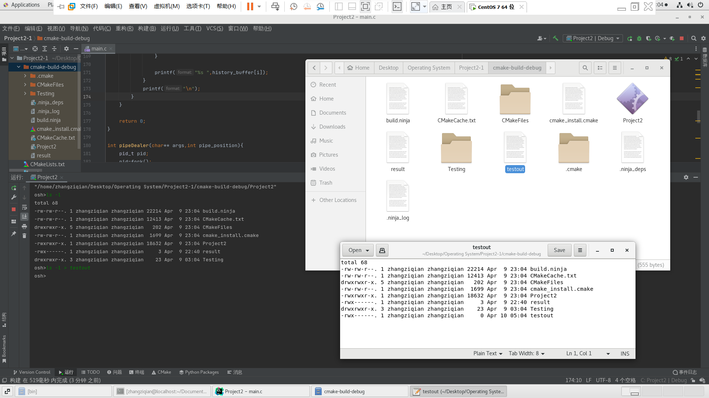
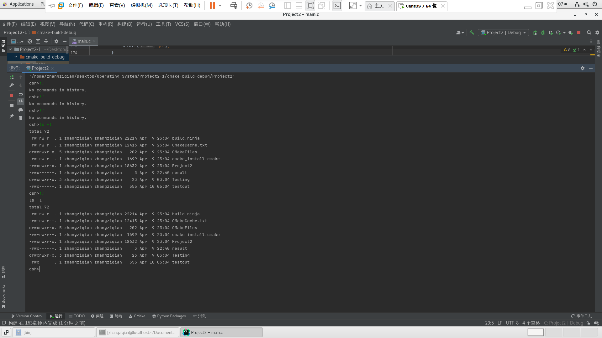
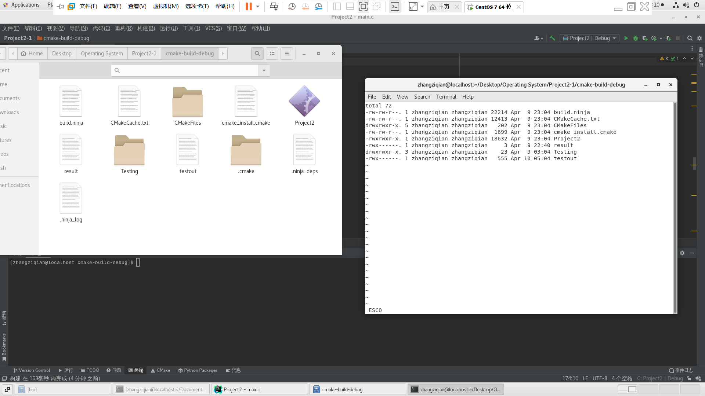
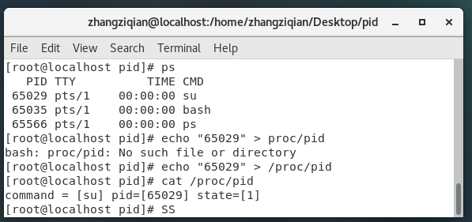

### Project 2 实验报告

> Students：Musicminion

[TOC]


#### 任务组一：UNIX Shell

> 该项目包括设计一个 C 程序作为 shell 接口，该接口接受用户命令，然后在单独的进程中执行每个命令。 您的实现将支持输入和输出重定向，以及作为 IPC 形式的一对命令之间的管道。 完成这个项目将涉及使用 UNIX fork()、exec()、wait()、dup2() 和 pipe() 系统调用，并且可以在任何 Linux、UNIX 或 macOS 系统上完成。

##### 一、概述

###### a) shell 界面介绍

shell 界面给用户一个提示，然后输入下一个命令。 下面的示例说明了提示符 `osh>` 和用户的下一个命令：`cat prog.c`。 （此命令使用 UNIX cat 命令在终端上显示文件 prog.c。）

```
osh>cat prog.c
```

实现 shell 接口的一种技术是让父进程首先读取用户在命令行上输入的内容（在本例中为 cat prog.c），然后创建一个单独的子进程来执行命令。 除非另有说明，否则父进程在继续之前等待子进程退出。 这在功能上类似于图 3.9 中所示的新流程创建。 然而，UNIX shell 通常也允许子进程在后台运行，或者同时运行。 为此，我们在命令末尾添加一个 & 符号。 因此，如果我们将上述命令重写为如下，这样父进程和子进程将同时运行。

```
osh>cat prog.c &
```

###### b) 代码样例

- 使用 fork() 系统调用创建单独的子进程，并使用 exec() 系列中的系统调用之一执行用户命令。

- 下面提供了一个提供命令行 shell 的一般操作的 C 程序。 main() 函数显示提示 `osh>` 并概述在读取用户输入后要采取的步骤。 只要应该 run 等于 1，main() 函数就会不断循环； 当用户在提示符下输入 exit 时，您的程序将设置应该运行为 0 并终止。

```c
#include <stdio.h>
#include <unistd.h>
#define MAX LINE 80 				/* The maximum length command */
int main(void)
{
    char *args[MAX LINE/2 + 1]; 	/* command line arguments */
    int should run = 1; 			/* flag to determine when to exit program */
    while (should run) {
    	printf("osh>");
    	fflush(stdout);
    /**
    * After reading user input, the steps are:
    * (1) fork a child process using fork()
    * (2) the child process will invoke execvp()
    * (3) parent will invoke wait() unless command included &
    */
    }
	return 0;
}
```

###### b) 项目内容介绍

本次的项目分为一下几个部分：

1. 创建子进程并在子进程中执行命令。
2. 提供一个历史功能
3. 增加对输入输出重定向的功能
4. 允许父子进程通过管道通讯


##### 二、在子进程中执行命令

第一个任务是修改图 3.36 中的 main() 函数，以便派生一个子进程并执行用户指定的命令。 这将需要将用户输入的内容解析到单独的标记中，并将标记存储在字符串数组中（图 3.36 中的 args）。 例如，如果用户在 osh> 提示符下输入命令 `ps -ael`，则存储在 args 数组中的值为：

```c
    args[0] = "ps"
    args[1] = "-ael"
    args[2] = NULLc
```

这个 args 数组将被传递给 execvp() 函数，该函数具有以下原型：

```
execvp(char *command, char *params[])
```

- command 表示要执行的命令，
- params 存储该命令的参数。
-  对于这个项目，execvp() 函数应该被调用为 execvp(args[0], args)。 
- 一定要检查用户是否包含&来判断父进程是否要等待子进程退出。

例如，下面的代码完成口令的识别与切割功能，分割单位是空格。

```c
void token_initAndGet(char** args, char** history_buffer,char* Instruction, char* last_parameter){
    for(int i=0;i<MAX_LINE/2+1;++i)
        args[i]=NULL;

    printf("osh>");
    fflush(stdout);
    fgets(Instruction,MAX_LINE,stdin);
    init_args(Instruction,args,last_parameter);
    init_history(history_buffer,args,last_parameter);
    free(Instruction);
    free(last_parameter);
}
```

```c
char **init_args(char* Instruction,char** args,char * last_parameter)
{
    //DeInstruction
    int Index_Instruction=0;
    int Index_args=0;
    char tmp=Instruction[Index_Instruction];
    int precious_is_space=0;

    while(tmp!='\n'&&tmp!=EOF)
    {
        if(Index_Instruction==0)
        {
            free(args[0]);
            args[0]=(char *) malloc(sizeof(char)*MAX_LINE);
            memset(args[0], 0, sizeof(args[0]));

        }
        if(tmp==' ')
        {
            if(precious_is_space==0)
            {
                Index_args++;
                args[Index_args]=(char *)malloc(sizeof(char)*MAX_LINE);
                precious_is_space=1;
            }
        }
        else
        {
            strncat(args[Index_args],&tmp,1);

            precious_is_space=0;
        }

        Index_Instruction++;
        tmp=Instruction[Index_Instruction];
    }

    if(args[Index_args]!=NULL)
        strcpy(last_parameter,args[Index_args]);
    if(strcmp(last_parameter,"&&")==0)
        args[Index_args]=NULL;
}
```


##### 三、增加历史记录功能

下一个任务是修改 shell 接口程序，使其提供历史功能，允许用户通过输入`!!` 来执行最近的命令。 例如，如果用户输入命令 `ls -l`，然后她可以通过输入` !!` 再次执行该命令。 在提示下。 以这种方式执行的任何命令都应该在用户屏幕上回显，并且该命令也应该作为下一个命令放置在历史缓冲区中。 您的程序还应该管理基本的错误处理。 如果历史记录中没有最近的命令，输入 `!!` 应打印消息“历史记录中没有命令”。

- 我编写了下面的函数，针对性的处理 `!!`的命令
- 首先检测 `buffer` 里面有没有历史命令，如果没有，那就说明用户之前没有历史命令，需要提示
- 有的话就会进行一次历史命令的拷贝，这样方便后期的执行工作。

```c

int historyDealer(char** history_buffer, char** args){
    //!! check

    if(args[0]!=NULL&&strcmp(args[0],"!!")==0)
    {
        free(args[0]);
        args[0]=NULL;
        if(history_buffer[0]==NULL)
        {
            printf("No commands in history.\n");
            return 1;
        }
        else
        {
            for(int i=0;i<MAX_LINE/2+1;++i)
            {
                if(history_buffer[i]==NULL)
                    break;
                else
                {
                    args[i]=(char*)malloc(MAX_LINE*sizeof(char));
                    strcpy(args[i],history_buffer[i]);
                }

                printf("%s ",history_buffer[i]);
            }
            printf("\n");
        }
    }
    
    return 0;
}

```


##### 四、重定向输入和输出功能

- 现在应该修改您的 shell 以支持“>”和“<”重定向运算符，其中“>”将命令的输出重定向到文件，“<”将输入重定向到文件中的命令。例如，如果用户输入

```
osh>ls > out.txt
```

- ls 命令的输出将被重定向到文件 out.txt。同样，输入也可以重定向。例如，如果用户输入

```
osh>sort < in.txt
```

- in.txt 文件将用作排序命令的输入。
- 管理输入和输出的重定向将涉及使用 dup2() 函数，该函数将现有文件描述符复制到另一个文件描述符。例如，如果 fd 是文件 out.txt 的文件描述符，则调用 dup2（fd，标准输出文件号）
- 将 fd 复制到标准输出（终端）。这意味着对标准输出的任何写入实际上都将发送到 out.txt 文件。您可以假设命令将包含一个输入或一个输出重定向，并且不会同时包含两者。换句话说，您不必关心诸如 `sort < in.txt > out.txt` 之类的命令序列。

具体实现：

- 对于 `>`  `<` 两个特殊的口令单独检测，例如下面的两个函数

```c
redirect_output(args);
redirect_input(args,last_parameter);
```

```c
void redirect_output(char** args)
{
    for(int i=0;i<MAX_LINE/2+1;++i)
    {
        if(args[i]!=NULL && strcmp(args[i],">")==0)// > exists
        {
            char file_name[MAX_LINE];
            strcpy(file_name,args[i+1]);
            int fd=open(file_name,O_RDWR | O_NOCTTY | O_NDELAY);

            if(fd == -1){
                fd = creat(file_name,S_IRWXU);
            }
            dup2(fd,STDOUT_FILENO);

            free(args[i]);
            free(args[i+1]);
            args[i]=NULL;
            args[i+1]=NULL;

            close(fd);
        }
    }
}

int redirect_input(char** args,char* last_parameter)
{
    for(int i=0;i<MAX_LINE/2+1;++i)
    {
        if(args[i]!=NULL && strcmp(args[i],"<")==0)// < exists
        {
            char file_name[MAX_LINE];
            strcpy(file_name,args[i+1]);

            int fd=open(file_name,O_RDWR | O_NOCTTY | O_NDELAY);

            free(args[i]);
            free(args[i+1]);
            args[i]=NULL;
            args[i+1]=NULL;
            dup2(fd,STDIN_FILENO);
            char Instruction[MAX_LINE*sizeof(char)];
            fgets(Instruction,MAX_LINE,stdin);
            init_args(Instruction,args+i,last_parameter);

            close(fd);
        }
    }
    return 0;
}
```


##### 五、通过管道通讯

对 shell 的最后修改是允许一个命令的输出使用管道作为另一个命令的输入。例如下面的命令序列

```
osh>ls -l | less
```

将命令 ls -l 的输出用作 less 命令的输入。 ls 和 less 命令都将作为单独的进程运行，并将使用 3.7.4 节中描述的 UNIX pipe() 函数进行通信。创建这些独立进程的最简单方法可能是让父进程创建子进程（它将执行 ls -l）。这个子进程还将创建另一个子进程（执行较少），并将在它自己和它创建的子进程之间建立一个管道。实现管道功能还需要使用上一节中描述的 dup2() 函数。最后，尽管可以使用多个管道将多个命令链接在一起，但您可以假设命令将仅包含一个管道字符并且不会与任何重定向运算符组合。

- 对于父进程，只执行第一段的命令
- 对于子进程，执行 `|` 后面的命令
- 将父进程的输出结果作为子进程的标准输入。

```c
int pipeDealer(char** args,int pipe_position){
    pid_t pid;
    pid=fork();

    if(pid==0)//child process
    {
        int fd[2];
        pid_t pid;

        /*create a pipe*/
        if(pipe(fd)==-1)
        {
            fprintf(stderr,"Pipe failed");
            return 1;
        }

        pid=fork();

        if(pid>0)//parent process(actually child process of the initial one)
        {
            for(int i=pipe_position;i<MAX_LINE/2+1;++i)
            {
                free(args[i]);
                args[i]=NULL;
            }
            close(fd[READ_END]);
            dup2(fd[WRITE_END],STDOUT_FILENO);
            execvp(args[0],args);
        }
        else if(pid==0)//grandson process
        {
            strcpy(args[0],args[pipe_position+1]);
            for(int i=1;i<MAX_LINE/2+1;++i)
            {
                free(args[i]);
                args[i]=NULL;
            }
            close(fd[WRITE_END]);
            dup2(fd[READ_END],STDIN_FILENO);
            execvp(args[0],args);
        }
    }
    else // father process
    {
        wait(NULL);
    }
    return 0;
}
```


##### 六、完整的代码

- 主函数内容还是比较简洁的
- 首先要获取用户的输入口令
- 然后要针对集中特别的情况：
  - 例如 `exit` 退出口令
  - 例如`!!` 历史口令
- 执行口令，要分为两种情况
  - 带有管道的情况
  - 不带有管道的情况
- 清理内存，释放空间

```c
// Student: zhangziqian
// ID: 520111910121
// 2022 OS Project2 - shell

int main(void)
{
    char *args[MAX_LINE/2 + 1]={NULL};
    char *history_buffer[MAX_LINE/2 + 1]={NULL};
    int should_run = 1;

    while (should_run){
        char * Instruction=(char*) malloc(sizeof(char)*MAX_LINE);
        char * last_parameter=(char *) malloc (sizeof(char)*MAX_LINE);

        token_initAndGet(args,history_buffer,Instruction,last_parameter);

        // specially deal with !!
        if(historyDealer(history_buffer,args) == 1){
            continue;
        }

        // deal with exit
        if(args[0]!=NULL&&strcmp(args[0],"exit")==0)
        {
            should_run=0;
            continue;
        }

        //token executor
        int pipe_position=detect_pipe(args);
        if(pipe_position!=0)// pipe exists
            pipeDealer(args,pipe_position);
        else
            NONEpipeDealer(args,last_parameter,&should_run);
    }
    clearAll(args,history_buffer);
    return 0;
}
```


```c
// Student: zhangziqian
// ID: 520111910121
// 2022 OS Project2

# include <stdlib.h>
# include <string.h>
# include <unistd.h>
# include <sys/wait.h>
# include <stdio.h>
# include <fcntl.h>
# include <sys/types.h>
#define MAX_LINE 80
#define REDIRECT_INPUT_FAIL 1
#define READ_END 0
#define WRITE_END 1


char **init_history(char** history_buffer,char** args,char* last_parameter)
{
    if(args[0]==NULL || strcmp(args[0],"!!")==0)
        return NULL;
    int i=0;
    for(i=0;i<MAX_LINE/2+1;i++)
    {
        if(args[i]==NULL)
            break;
        history_buffer[i]=(char*) malloc(MAX_LINE*sizeof(char));
        strcpy(history_buffer[i],args[i]);
    }
    if(strcmp(last_parameter,"&&")==0)
    {
        history_buffer[i]=(char*) malloc(MAX_LINE*sizeof(char));
        history_buffer[i]="&&";
    }

}

char **init_args(char* Instruction,char** args,char * last_parameter)
{
    //DeInstruction
    int Index_Instruction=0;
    int Index_args=0;
    char tmp=Instruction[Index_Instruction];
    int precious_is_space=0;

    while(tmp!='\n'&&tmp!=EOF)
    {
        if(Index_Instruction==0)
        {
            free(args[0]);
            args[0]=(char *) malloc(sizeof(char)*MAX_LINE);
            memset(args[0], 0, sizeof(args[0]));

        }
        if(tmp==' ')
        {
            if(precious_is_space==0)
            {
                Index_args++;
                args[Index_args]=(char *)malloc(sizeof(char)*MAX_LINE);
                precious_is_space=1;
            }
        }
        else
        {
            strncat(args[Index_args],&tmp,1);

            precious_is_space=0;
        }

        Index_Instruction++;
        tmp=Instruction[Index_Instruction];
    }

    if(args[Index_args]!=NULL)
        strcpy(last_parameter,args[Index_args]);
    if(strcmp(last_parameter,"&&")==0)
        args[Index_args]=NULL;
}


void redirect_output(char** args)
{
    for(int i=0;i<MAX_LINE/2+1;++i)
    {
        if(args[i]!=NULL && strcmp(args[i],">")==0)// > exists
        {
            char file_name[MAX_LINE];
            strcpy(file_name,args[i+1]);
            int fd=open(file_name,O_RDWR | O_NOCTTY | O_NDELAY);

            if(fd == -1){
                fd = creat(file_name,S_IRWXU);
            }
            dup2(fd,STDOUT_FILENO);

            free(args[i]);
            free(args[i+1]);
            args[i]=NULL;
            args[i+1]=NULL;

            close(fd);
        }
    }
}

int redirect_input(char** args,char* last_parameter)
{
    for(int i=0;i<MAX_LINE/2+1;++i)
    {
        if(args[i]!=NULL && strcmp(args[i],"<")==0)// < exists
        {
            char file_name[MAX_LINE];
            strcpy(file_name,args[i+1]);

            int fd=open(file_name,O_RDWR | O_NOCTTY | O_NDELAY);

            free(args[i]);
            free(args[i+1]);
            args[i]=NULL;
            args[i+1]=NULL;
            dup2(fd,STDIN_FILENO);
            char Instruction[MAX_LINE*sizeof(char)];
            fgets(Instruction,MAX_LINE,stdin);
            init_args(Instruction,args+i,last_parameter);

            close(fd);
        }
    }
    return 0;
}

int detect_pipe(char** args)
{
    for(int i=0;i<MAX_LINE/2+1;++i)
    {
        if(args[i]!=NULL && strcmp(args[i],"|")==0)
            return i;
    }
    return 0;
}

int historyDealer(char** history_buffer, char** args){
    //!! check

    if(args[0]!=NULL&&strcmp(args[0],"!!")==0)
    {


        free(args[0]);
        args[0]=NULL;


        if(history_buffer[0]==NULL)
        {
            printf("No commands in history.\n");
            return 1;
        }
        else
        {
            for(int i=0;i<MAX_LINE/2+1;++i)
            {
                if(history_buffer[i]==NULL)
                    break;
                else
                {
                    args[i]=(char*)malloc(MAX_LINE*sizeof(char));
                    strcpy(args[i],history_buffer[i]);
                }

                printf("%s ",history_buffer[i]);
            }
            printf("\n");
        }
    }

    return 0;
}

int pipeDealer(char** args,int pipe_position){
    pid_t pid;
    pid=fork();

    if(pid==0)//child process
    {
        int fd[2];
        pid_t pid;

        /*create a pipe*/
        if(pipe(fd)==-1)
        {
            fprintf(stderr,"Pipe failed");
            return 1;
        }

        pid=fork();

        if(pid>0)//parent process(actually child process of the initial one)
        {

            for(int i=pipe_position;i<MAX_LINE/2+1;++i)
            {
                free(args[i]);
                args[i]=NULL;
            }
            close(fd[READ_END]);

            dup2(fd[WRITE_END],STDOUT_FILENO);

            execvp(args[0],args);

        }
        else if(pid==0)//grandson process
        {
            strcpy(args[0],args[pipe_position+1]);
            for(int i=1;i<MAX_LINE/2+1;++i)
            {
                free(args[i]);
                args[i]=NULL;
            }
            close(fd[WRITE_END]);
            dup2(fd[READ_END],STDIN_FILENO);
            execvp(args[0],args);
        }
    }
    else // father process
    {
        wait(NULL);
    }
    return 0;
}

int NONEpipeDealer(char** args,char* last_parameter,int* should_run){
    pid_t pid;
    pid=fork();

    if (pid==0) //child process
    {
        /*
        redirection output >
        */
        redirect_output(args);
        redirect_input(args,last_parameter);
        execvp(args[0],args);
        *should_run=0;
    }
    else //parent process
    {
        if(strcmp(last_parameter,"&&")!=0)
            wait(NULL);
    }

    return 0;
}

void token_initAndGet(char** args, char** history_buffer,char* Instruction, char* last_parameter){
    for(int i=0;i<MAX_LINE/2+1;++i)
        args[i]=NULL;

    printf("osh>");
    fflush(stdout);
    fgets(Instruction,MAX_LINE,stdin);
    init_args(Instruction,args,last_parameter);
    init_history(history_buffer,args,last_parameter);
    free(Instruction);
    free(last_parameter);
}

void clearAll(char** args, char** history_buffer){
    for(int i=0;i<MAX_LINE/2+1;i++)
        free(args[i]);
    for(int i=0;i<MAX_LINE/2+1;i++)
        free(history_buffer[i]);


}
```


##### 七、演示的效果图

> 我使用的是CLion IDE。所以这里直接构建并且运行。

###### 1、输入命令的演示



- 可以看到可以识别命令并且正常输出


###### 2、重定向的演示



- 可以看到，我执行了 `ls - l > testout`，在文件的根目录中就会创建一个相对应名称的文件
- 打开文件可以看到原本输出的内容变成了文件中的内容
- 控制台上空白，没有任何内容输出。


###### 3、历史功能的演示



- 可以看到如果开始就执行 `!!`,就会提示没有历史命令
- 同样的，如果我们连续执行两次回退历史的命令，最终的效果也是提示没有历史命令的。
- 最后，我们执行了 `ls -l`命令，然后执行 `!!`,可以看到，上一次的命令被正常输出。


###### 4、管道功能的演示

- 执行 `le -l | less` ，可以看到如下结果。说明管道功能正常，成功的将第一个运行的参数传递给第二个
- 编辑页面打开，在靠右侧的编辑框




#### 任务组二：用于任务信息的 Linux 内核模块

> 在这个项目中，您将编写一个 Linux 内核模块，该模块使用 /proc 文件系统根据其进程标识符值 pid 显示任务的信息。 在开始这个项目之前，请确保您已经完成了第 2 章中的 Linux 内核模块编程项目，其中涉及在 /proc 文件系统中创建一个条目。 该项目将涉及将进程标识符写入文件 /proc/pid。 一旦 pid 被写入 /proc 文件，随后从 /proc/pid 读取将报告 (1) 任务正在运行的命令，(2) 任务 pid 的值，以及 (3) 当前状态 任务。 

加载到系统后如何访问内核模块的示例如下：

```
echo "1395" > /proc/pid
cat /proc/pid
command = [bash] pid = [1395] state = [1]
```

`echo` 命令将字符“1395”写入 `/proc/pid` 文件。您的内核模块将读取此值并存储其等效整数，因为它表示进程标识符。 cat 命令从 `/proc/pid` 读取，您的内核模块将从与` pid `值为` 1395` 的任务关联的任务结构中检索三个字段。

```c
ssize_t proc write(struct file *file, char _user *usr buf, size_t count, loff_t *pos)
{
    int rv = 0;
    char *k_mem;
    /* allocate kernel memory */
    k_mem = kmalloc(count, GFP_KERNEL);
    /* copies user space usr buf to kernel memory */
    copy_from_user(k_mem, usr_buf, count);
    printk(KERN_INFO "%s∖n", k_mem);
    /* return kernel memory */
    kfree(k_mem);
    return count;
}
```


##### 一、写入到 `/proc` 文件系统

- 在第 2 章的内核模块项目中，我们学习了如何从 /proc 文件系统中读取。我们现在介绍如何写入 /proc。将结构文件操作中的字段“.write”设置为

```
.write = proc write
```

- 从而使得当对 /proc/pid 进行写操作时，会调用图 3.37 的 proc write() 函数。

- kmalloc() 函数是用于分配内存的用户级 malloc() 函数的内核等效函数，除了分配内核内存。 GFP KERNEL 标志表示例行内核内存分配。 user() 函数的 copy 将 usr buf 的内容（包含已写入 /proc/pid 的内容）复制到最近分配的内核内存。内核模块必须使用具有签名的内核函数 kstrtol() 来获取此值的整数等价物。

- 这会将 str 的等价字符存储为 res 的基数。最后，请注意，我们通过调用 kfree() 将先前使用 kmalloc() 分配的内存返回给内核。仔细的内存管理（包括释放内存以防止内存泄漏）在开发内核级代码时至关重要。


##### 二、从`/proc` 文件系统读取

- 一旦存储了进程标识符，从 /proc/pid 读取的任何内容都将返回命令的名称、进程标识符和状态。如 3.1 节所示，Linux 中的 PCB 由结构体 task struct 表示，该结构体 task struct 位于 <linux/sched.h> 包含文件中。给定进程标识符，函数 pid task() 返回关联的任务结构。该函数的签名如下所示：

```
struct task struct pid task(struct pid *pid,
	enum pid type type)
```


##### 三、原始代码

```c
/**
 * Kernel module that communicates with /proc file system.
 *
 * This provides the base logic for Project 2 - displaying task information
 */

#include <linux/init.h>
#include <linux/slab.h>
#include <linux/sched.h>
#include <linux/module.h>
#include <linux/kernel.h>
#include <linux/proc_fs.h>
#include <linux/vmalloc.h>
#include <asm/uaccess.h>

#define BUFFER_SIZE 128
#define PROC_NAME "pid"

/* the current pid */
static long l_pid;

/**
 * Function prototypes
 */
static ssize_t proc_read(struct file *file, char *buf, size_t count, loff_t *pos);
static ssize_t proc_write(struct file *file, const char __user *usr_buf, size_t count, loff_t *pos);

static struct file_operations proc_ops = {
        .owner = THIS_MODULE,
        .read = proc_read,
	.write = proc_write,
};

/* This function is called when the module is loaded. */
static int proc_init(void)
{
        // creates the /proc/procfs entry
        proc_create(PROC_NAME, 0666, NULL, &proc_ops);

        printk(KERN_INFO "/proc/%s created\n", PROC_NAME);

	return 0;
}

/* This function is called when the module is removed. */
static void proc_exit(void) 
{
        // removes the /proc/procfs entry
        remove_proc_entry(PROC_NAME, NULL);

        printk( KERN_INFO "/proc/%s removed\n", PROC_NAME);
}

/**
 * This function is called each time the /proc/pid is read.
 * 
 * This function is called repeatedly until it returns 0, so
 * there must be logic that ensures it ultimately returns 0
 * once it has collected the data that is to go into the 
 * corresponding /proc file.
 */
static ssize_t proc_read(struct file *file, char __user *usr_buf, size_t count, loff_t *pos)
{
        int rv = 0;
        char buffer[BUFFER_SIZE];
        static int completed = 0;
        struct task_struct *tsk = NULL;

        if (completed) {
                completed = 0;
                return 0;
        }

        tsk = pid_task(find_vpid(l_pid), PIDTYPE_PID);
        if(tsk==NULL){
                printk(KERN_INFO "invalid pid!\n");
                return 0;
        }
        completed = 1;
        rv=sprintf(buffer,"command = [%s] pid=[%ld] state=[%ld]\n",tsk->comm,l_pid,tsk->state);
        // copies the contents of kernel buffer to userspace usr_buf 
        copy_to_user(usr_buf, buffer, rv);

        return rv;
}

/**
 * This function is called each time we write to the /proc file system.
 */
static ssize_t proc_write(struct file *file, const char __user *usr_buf, size_t count, loff_t *pos)
{
        char *k_mem;

        // allocate kernel memory
        k_mem = kmalloc(count, GFP_KERNEL);

        /* copies user space usr_buf to kernel buffer */
        if (copy_from_user(k_mem, usr_buf, count)) {
		printk( KERN_INFO "Error copying from user\n");
                return -1;
        }

	/**
 	 * kstrol() will not work because the strings are not guaranteed
	 * to be null-terminated.
	 * 
	 * sscanf() must be used instead.
	 */
	printk("%s",k_mem);
	sscanf(k_mem,"%ld",&l_pid);

        kfree(k_mem);

        return count;
}

/* Macros for registering module entry and exit points. */
module_init( proc_init );
module_exit( proc_exit );

MODULE_LICENSE("GPL");
MODULE_DESCRIPTION("Module");
MODULE_AUTHOR("SGG");

```


- 演示效果图




#### 任务小结

- 第一个项目 UNIX Shell 让我对 Shell 有更深的了解，难度也设置的恰到好处，四个功能层次递进，让我们一步步的实现这功能。 更重要的是，我们可以学习到练习使用管道和重定向操作。 
- 第二个项目 Linux Kernel Module for Task Information 深入到 Linux /proc 系统，让我复习了进程控制堵塞的知识。
- 这两个项目都很有趣。 通过完成这两个项目，我对C语言的一些要点有了更深刻的认识，尽管在C语言的运用和编写上与C++的熟练程度还有很大的差距。此外通过这个项目复习了我们在课堂上学习的知识，对一些基本的概念有了更深入的了解。

