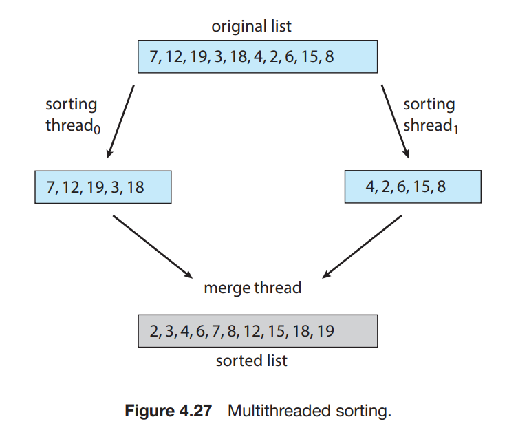
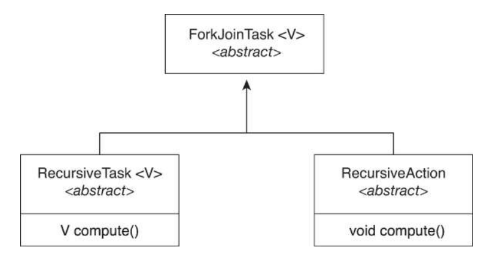
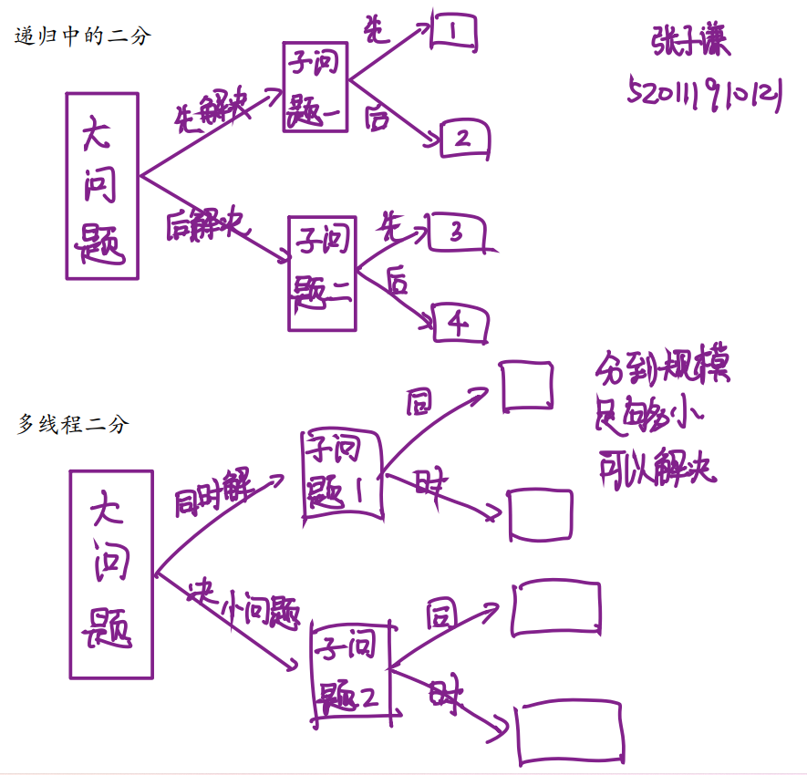
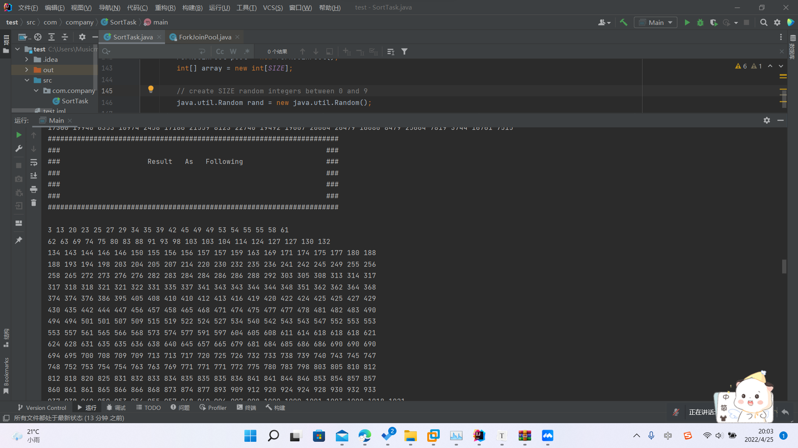
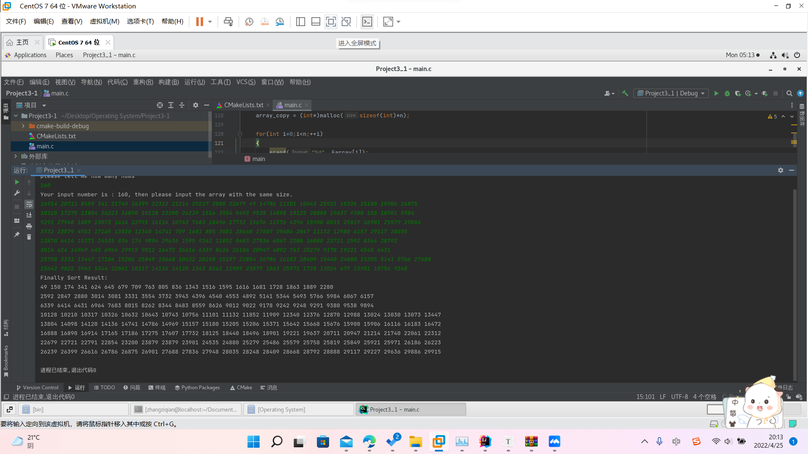

# Project 3-1 多线程排序应用程序

> > [TOC]
>
> 姓名：Musicminion


### Project 3-1 多线程排序应用程序

#### 一、任务要求

编写一个多线程排序程序，其实现原理和要求如下：

- 一个整数数组被分成两个大小相等的较小数组。
- 两个单独的线程（我们将其称为排序线程）使用您选择的排序算法对每个子列表进行排序。
- 然后，这两个子列表由第三个线程（合并线程）合并，该线程将两个子列表合并为一个排序列表。
- 因为全局数据在所有线程之间共享，所以设置数据的最简单方法可能是创建一个全局数组。每个排序线程将在这个数组的一半上工作。还将建立与未排序整数数组相同大小的第二个全局数组。
- 合并线程然后将两个子列表合并到第二个数组中。
- 从图形上看，这个程序的结构如图 4.27 所示。这个编程项目需要将参数传递给每个排序线程。特别是，有必要确定每个线程开始排序的起始索引。有关将参数传递给线程的详细信息，请参阅项目 1 中的说明。
- 一旦所有排序线程都退出，父线程将输出排序后的数组。



#### 二、基础知识

##### 1、头文件

- 使用前要加入头文件：

```c
#include <pthread.h>
```

##### 2、`pthread_attr_init` 函数

```c
int pthread_attr_init(pthread_attr_t *attr);
```

- 功能：初始化一个线程属性对象
- 参数：`*attr` 线程属性结构体指针变量
- 返回值：0代表成功，非0代表失败

##### 3、`create` 函数

```cpp
int pthread_create(pthread_t *tidp, const pthread_attr_t *attr, (void*)(*start_rtn)(void*),void *arg);
```

- 第一个参数为指向线程标识符的指针。
- 第二个参数用来设置线程属性。
- 第三个参数是线程运行函数的起始地址。
- 最后一个参数是运行函数的参数。
- 若线程创建成功，则返回`0`。若线程创建失败，则返回出错编号，并且`*thread`中的内容是未定义的。
- 返回成功时，由 `tidp` 指向的内存单元被设置为新创建线程的线程ID。`attr` 参数用于指定各种不同的线程属性。新创建的线程从` start_rtn`函数的地址开始运行，该函数只有一个万能指针参数 `arg`，如果需要向 `start_rtn` 函数传递的参数不止一个，那么需要把这些参数放到一个结构中，然后把这个结构的地址作为 `arg`的参数传入。

##### 4、`pthread join `函数

```cpp
int pthread_join(pthread_t thread, void **value_ptr);
```

- `thread`：等待退出线程的线程号。

- `value_ptr`：退出线程的返回值
- `pthread_join`：使一个线程等待另一个线程结束。
- 代码中如果没有`pthread_join`主线程会很快结束从而使整个进程结束，从而使创建的线程没有机会开始执行就结束了。加入`pthread_join`后，主线程会一直等待直到等待的线程结束自己才结束，使创建的线程有机会执行。
- 如果主线程，也就是main函数执行的那个线程，在你其他线程退出之前就已经退出，那么带来的bug则不可估量。通过pthread_join函数会让主线程阻塞，直到所有线程都已经退出。


#### 三、具体实现

##### 1、核心代码

```c
    pthread_t tid1, tid2, tid3;
    pthread_attr_t attr1, attr2, attr3;
    pthread_attr_init(&attr1);						//init attr1
    pthread_attr_init(&attr2);						//init attr2
    pthread_attr_init(&attr3);						//init attr3

	pthread_create(&tid1, &attr1, sort, r[0]);      //sort the first part
    pthread_create(&tid2, &attr2, sort, r[1]);      //sort the last  part

    pthread_join(tid1, NULL);                       //wait for tid1
    pthread_join(tid2, NULL);                       //wait for tid2

    pthread_create(&tid3, &attr3, merge, r[2]);     //merge
    pthread_join(tid3, NULL);                       //wait for tid3
```

**核心原理介绍：**

- `sort`函数会完成一个排序的工作，会完成它指定的范围内。
- 这一部分的代码对应上面的原理图。
- 首先要创建线程以及线程的属性并完成线程初始化的操作。
- 然后让一个线程 `tid1` 执行排序前半部分，另外的一个线程 `tid2`执行排序的后半部分，参数对应 `r[0] ` 、`r[1]`，表示排序的范围区间。
- 然后利用`pthread_join` 等待上面的两个函数排序执行完成，然后再归并。
- 归并利用的是`tid3` 线程，类比上面的。

##### 2、排序范围

为了更加方便的表示我们每次排序的起点，终点，我们不妨定义一个结构体来快速的表示。

- 第一个参数 `left` 表示排序的起点。
- 第二个参数 `right` 表示排序的终点。
- 第三个参数表示中间的变量。

```c
typedef struct
{
    /* data */
    int left;
    int right;
    int mid;
} sortRange;
```

##### 3、排序方法

快速排序的算法可以参见数据结构教材的知识，这里就不作解释。

- 第一个函数是一个包裹函数，会完成传入参数的起点，终点的位置解析
- 然后把数组传入，用我们常规的快速排序函数，完成排序。

```c
void *sort(void *r)
{
    int left = ((sortRange*)r)->left;
    int right = ((sortRange*)r)->right;
    quick_sort(array, left, right); 
}

void quick_sort(int *a, int low, int high)
{
    int i = low;
    int j = high;
    int pivot = a[low];
    if (low >= high) 
    {
        return ;
    }
    
    while (low < high) 
    {
        while (low < high && pivot <= a[high])
        {
            --high; 
        }
        if (pivot > a[high])
        {
            int tmp;
            tmp = a[low];
            a[low] = a[high];
            a[high] =tmp;
            ++low;
        }
        while (low < high && pivot >= a[low])
        {
            ++low; 
        }
        if (pivot < a[low])
        {
            int tmp;
            tmp = a[low];
            a[low] = a[high];
            a[high] =tmp;
            --high;
        }
    }
    quick_sort(a, i, low-1); 
    quick_sort(a, low+1, j);
}
```


##### 4、合并方法

- 在合并的过程中，我们引入了另外的一个一维数组，这个数组用作临时数据的保存。
- 首先，我们用一个 `copy_size` 表示临时数据数组有效数据的大小。
- 我们已经知道，$[0,mid]$，以及$[mid+1,right-1] $里面的数据都是有序的，所以我们要做的就是合并这两个数组
- 合并过程中，可能出现有一个数组已经用完了，但是另外一个数组里面还有数据，这时候就需要单独的拷贝完剩下的数组。
- 最终，要记得把 `copy` 数组里面的所有东西全部恢复到原来的数组中。完成所有的归并工作

```c
void *merge(void *r)
{       
    int left = ((sortRange*)r)->left;
    int right = ((sortRange*)r)->right;
    int mid = ((sortRange*)r)->mid;
    int range1_current=left;
    int range2_current=mid+1;
    int copy_size = 0;

    // 抓小的数据
    while(range1_current<=mid && range2_current<=right)
    {
        if(array[range1_current]<=array[range2_current])
            {
                array_copy[copy_size]=array[range1_current];
                range1_current++;
                copy_size++;
            }
        else
        {
            array_copy[copy_size]=array[range2_current];
            range2_current++;
            copy_size++;
        }
    }

    // 完美抓完，就跳过下面的处理过程
	// 运气不太好，有一个数组还有好多数据没有抓完，就继续抓一遍
    else if(range1_current<mid)
    {
        for(int i=range1_current;i<=mid;i++)
        {
        	array_copy[copy_size]=array[i];
          	copy_size++;
        }
    }
    // 运气不太好，有一个数组还有好多数据没有抓完，就继续抓一遍
    else if(range2_current<right)
    {
        for(int i=range2_current;i<=right;i++)
        {
                array_copy[copy_size]=array[i];
                copy_size++;
        }
    }  
    
    for(int i=0; i<=right;i++)
		array[i]=array_copy[i];
    return;
}
```


##### 5、完整的代码

```c
#include <pthread.h>
#include <stdio.h>
#include <stdlib.h>

int *array;
int *array_copy;

typedef struct
{
    /* data */
    int left;
    int right;
    int mid;
} sortRange;


void quick_sort(int *a, int low, int high)
{
    int i = low;
    int j = high;
    int pivot = a[low];
    if (low >= high) 
    {
        return ;
    }
    
    while (low < high) 
    {
        while (low < high && pivot <= a[high])
        {
            --high; 
        }
        if (pivot > a[high])
        {
            int tmp;
            tmp = a[low];
            a[low] = a[high];
            a[high] =tmp;
            ++low;
        }
        while (low < high && pivot >= a[low])
        {
            ++low; 
        }
        if (pivot < a[low])
        {
            int tmp;
            tmp = a[low];
            a[low] = a[high];
            a[high] =tmp;
            --high;
        }
    }
    quick_sort(a, i, low-1); 
    quick_sort(a, low+1, j);
}

void *sort(void *r)
{
    int left = ((sortRange*)r)->left;
    int right = ((sortRange*)r)->right;
    quick_sort(array, left, right); 
}

void *merge(void *r)
{   

    
    int left = ((sortRange*)r)->left;
    int right = ((sortRange*)r)->right;
    int mid = ((sortRange*)r)->mid;

    int range1_current=left;
    int range2_current=mid+1;
    int copy_size = 0;

    while(range1_current<=mid && range2_current<=right)
    {
        if(array[range1_current]<=array[range2_current])
            {
                array_copy[copy_size]=array[range1_current];
                range1_current++;
                copy_size++;
            }
        else
        {
            array_copy[copy_size]=array[range2_current];
            range2_current++;
            copy_size++;
        }
    }

    if(copy_size==right)
    {
        for(int i=left;i<=right;i++)
            array[i]=array_copy[i];
        return;
    }

    else if(range1_current<mid)
    {
        for(int i=range1_current;i<=mid;i++)
            {
                array_copy[copy_size]=array[i];
                copy_size++;
            }
        for(int i=0; i<=right;i++)
            array[i]=array_copy[i];
        return;
    }
    
    else if(range2_current<right)
    {
        for(int i=range2_current;i<=right;i++)
            {
                array_copy[copy_size]=array[i];
                copy_size++;
            }

        for(int i=0; i<=right;i++)
            array[i]=array_copy[i];
        return;
    }  
}

int main()
{
    int n;
    scanf("%d", &n);
    printf("Your input number is : %d, then please input the array with the same size. \n", n);
    array = (int*)malloc(sizeof(int)*n);
    array_copy = (int*)malloc(sizeof(int)*n);

    for(int i=0;i<n;++i)
    {
        scanf("%d", &array[i]);        
    }

    pthread_t tid1, tid2, tid3;
    pthread_attr_t attr1, attr2, attr3;
    pthread_attr_init(&attr1);
    pthread_attr_init(&attr2);
    pthread_attr_init(&attr3);

    sortRange *r[3];
    for(int i=0;i<3;++i)
        r[i] = (sortRange*)malloc(sizeof(sortRange));

    int mid = (n-1)/2;
    if(n>1){
        r[0]->left = 0;
        r[0]->right = mid;

        r[1]->left = mid+1;
        r[1]->right = n-1;
        r[2]->left = 0;
        r[2]->right = n-1;
        r[2]->mid = mid;
    }
    
    else if(n==1)
    {
        printf("Sort Result: %d\n", array[0]);
        return 0;
    }

    pthread_create(&tid1, &attr1, sort, r[0]);      //sort
    pthread_create(&tid2, &attr2, sort, r[1]);      //sort

    pthread_join(tid1, NULL);                       //wait for tid1
    pthread_join(tid2, NULL);                       //wait for tid2

    pthread_create(&tid3, &attr3, merge, r[2]);     //merge
    pthread_join(tid3, NULL);                       //wait for tid3

    printf("Finally Sort Result: ");
    for(int i=0;i<n;++i)
    {
        printf("%d ", array[i]);
    }
    printf("\n");
    // free space
    for(int i=0;i<3;++i)
        free(r[i]);
    free(array_copy);
    free(array);

    return 0;
}
```


### Project 3-2 Fork-Join 排序应用程序

#### 一、任务要求

- 使用 Java 的 fork-join 并行 API 实现前面的项目（多线程排序应用程序）。该项目将分成两个不同的版本。每个版本都将实现不同的分治排序算法：
  - 快速排序
  - 归并排序

- `Quicksort` 实现将使用 `Quicksort` 算法根据枢轴值的位置将要排序的元素列表分为左半部分和右半部分。 `Mergesort` 算法将列表分成大小均匀的两半。对于 `Quicksort` 和 `Mergesort` 算法，当要排序的列表在某个范围内时（例如，列表大小为 100 或更少），直接应用简单的算法，例如选择或插入排序。大多数数据结构教程都描述了这两种众所周知的分而治之的排序算法。 
- 4.5.2.1 节所示的 `SumTask` 类扩展了 `RecursiveTask`，它是一个结果承载的 `ForkJoinTask`。由于此分配将涉及对传递给任务的数组进行排序，但不返回任何值，因此您将创建一个扩展 `RecursiveAction` 的类，这是一个非结果承载的`ForkJoinTask`（参见图 4.19）。
- 传递给每个排序算法的对象都需要实现 Java 的 `Comparable` 接口，这需要反映在每个排序算法的类定义中。

#### 二、基础知识

##### 1、关于Java

- 这个任务的编程需要使用到Java语言，Java是严格面向对象的，所以函数都被封装在一个类里面。

- 类似`C++`的 `include` ，`java`中是 `import`。

- 简而言之这次的任务就是，面对比较大的问题，变成两个小的问题解决，分别让两个线程去做，做完之后合并，得到结果。

- 这样做的一个显著优点就是提高效率，节省运行的时间。

- 下面的是解决这种问题的一个伪代码，可以用来阐述我们面对这类问题的思想。

- ```java
  public void Task(problem){
  	if (problem > sizeDefined)
  		solution(problem);
  	else{
  		subTask1 = fork(new Task(subTaskProblem1));
  		subTask2 = fork(new Task(subTaskProblem2));
  		
  		result = join(subtask1);
  		result = join(subtask2);
  		
  		return combined_result;
  	}
  }		
  ```

- 图片样例解说



##### 2、关于教材的源代码

在教材中给了我们一个源代码的参考样例，这一段代码是用来求解一个数组的和的。

- `THRESHOLD` 就是我们上面说的一个阈值，如果这个问题的规模大小`SIZE`超过了的话，我们就要采取分解的方法。

- `SIZE` 是我们这个问题定义的规模，可以自行修改，也是用来和上面的那个作比较。

- `main`函数中这个程序执行的入口。

- `computute` 这个函数非常重要，相当于递归，但是又不同于递归。所以必须要有一个终止的条件（规模较小），反之，就继续分下去。

- **注释：**这个代码和二分递归有什么区别？如下所示（手绘），递归中，是先解决第一个小问题，在第一个小问题中看规模如何，如果大的话可能还要继续二分，直到规模足够小，可以一次性的解决。但是多线程中，把问题分成两个小的子问题，然后会同时的解决这两个小问题。

- 如下图所示：

  

- 代码解说如下：

```java
import java.util.concurrent.*;

public class SumTask extends RecursiveTask<Integer>
{
    static final int SIZE = 10000;
    static final int THRESHOLD = 1000;

    private int begin;
    private int end;
    private int[] array;

    public SumTask(int begin, int end, int[] array) {
        // 把这个类的承担的求和范围设置好，数据来源是父线程。
        this.begin = begin;
        this.end = end;
        this.array = array;
    }

    protected Integer compute() {
        if (end - begin < THRESHOLD) {
            // conquer stage 
            int sum = 0;
            for (int i = begin; i <= end; i++)
                sum += array[i];

            return sum;
        }
        else {
            // divide stage 
            int mid = begin + (end - begin) / 2;
            
            // 这里是创建两个新的sumTask类，分别进行求和。
            // 注意，这里要写清楚范围，不然后面的排序无法进行
            SumTask leftTask = new SumTask(begin, mid, array);
            SumTask rightTask = new SumTask(mid + 1, end, array);

            leftTask.fork();
            rightTask.fork();

            // 这里是把两个子求和结果合并，当然，也能作为父亲线程
            // 的rightTask.join()或者leftTask.join();
            return rightTask.join() + leftTask.join();
        }
    }

	public static void main(String[] args) {
		ForkJoinPool pool = new ForkJoinPool();
		int[] array = new int[SIZE];

		// create SIZE random integers between 0 and 9
		java.util.Random rand = new java.util.Random();

		for (int i = 0; i < SIZE; i++) {
			array[i] = rand.nextInt(10);
		}		
		
		// use fork-join parallelism to sum the array
		SumTask task = new SumTask(0, SIZE-1, array);

		int sum = pool.invoke(task);

		System.out.println("The sum is " + sum);
	}
}
```


#### 三、实现原理

##### 1、核心代码

- 核心就是分治，具体可以看下面的代码
- 注释就是解释

```java
protected void compute()
{
		// 如果问题的规模很小，直接快速排序
        if (end - begin < THRESHOLD) {
            this.quick_sort_pivot(begin, end);
            return;
        }
    	// 如果问题的规模很大，就分成小问题解决
        else{
            // divide stage
            int mid = (end+begin) / 2;
            
            // new一个新的排序类
            SortTask leftTask = new SortTask(begin, mid, array);
            SortTask rightTask = new SortTask(mid + 1, end, array);
			
            // 分别左右两个子线程把自己的排序拍好
            leftTask.fork();
            rightTask.fork();
			
            //排序结束
            leftTask.join();
            rightTask.join();
            
            // 合并到一块即可
            this.merge(begin, mid, end);
            //return;
        }
}
```

##### 2、归并排序

- 快速排序的方法和上面的一道题目非常相似，归并也是一样的道理，只是稍作修改

```java
private void merge(int left, int mid, int right)
{
        int current1=left;
        int current2= mid + 1;
        int copy_id =left;
        int[] array_copy = new int[SIZE];

        while(current1<=mid && current2<=right)
        {
            if(array[current1]<=array[current2])
            {
                array_copy[copy_id]=array[current1];
                current1++;
                copy_id++;
            }
            else
            {
                array_copy[copy_id]=array[current2];
                current2++;
                copy_id++;
            }
        }

        if(current1<=mid)
        {
            for(int i=current1;i<=mid;i++)
            {
                array_copy[copy_id]=array[i];
                copy_id++;
            }
        }
        else if(current2<=right)
        {
            for(int i=current2;i<=right;i++)
            {
                array_copy[copy_id]=array[i];
                copy_id++;
            }
        }

        for(int i=left;i<=right;i++)
            array[i]=array_copy[i];
}

```

##### 3、选择排序

- 选择排序也是数据结构的基本知识，这里只展示代码。

```java
private void selection_sort(int low, int high)
{
        for(int i=low;i<high;i++)
        {
            int min = array[i];
            for(int j=i+1;j<=high;j++)
            {
                if(array[j]<min)
                {
                    min = array[j];
                    array[j] = array[i];
                    array[i] = min;
                }
            }
        }
}
```


##### 4、完整代码

```java
package com.company;
import java.util.concurrent.*;

public class SortTask extends RecursiveAction
{
    static final int SIZE = 9000;
    static final int THRESHOLD = 500;

    private int begin;
    private int end;
    private int[] array;

    public SortTask(int begin, int end, int[] array)
    {
        this.begin = begin;
        this.end = end;
        this.array = array;
    }

    protected void compute()
    {
        if (end - begin < THRESHOLD) {
            this.quick_sort_pivot(begin, end);
            return;
        }
        else{
            // divide stage
            int mid = (end+begin) / 2;
            SortTask leftTask = new SortTask(begin, mid, array);
            SortTask rightTask = new SortTask(mid + 1, end, array);

            leftTask.fork();
            rightTask.fork();

            leftTask.join();
            rightTask.join();
            this.merge(begin, mid, end);
            //return;
        }
    }
    public void quick_sort_pivot(int low, int high)
    {
        if(low >= high)
            return;
        int i=low;
        int j=high;
        int pivot = array[low];

        while(low<high)
        {
            while(low<high && pivot<=array[high])
                high--;
            if(pivot > array[high])
            {
                int tmp;
                tmp = array[low];
                array[low] = array[high];
                array[high] =tmp;
                ++low;
            }
            while (low < high && pivot >= array[low])
                low++;
            if (pivot < array[low])
            {
                int tmp;
                tmp = array[low];
                array[low] = array[high];
                array[high] =tmp;
                --high;
            }
        }
        quick_sort_pivot(i, low - 1);
        quick_sort_pivot(low + 1, j);
    }

    private void selection_sort(int low, int high)
    {
        for(int i=low;i<high;i++)
        {
            int min = array[i];
            for(int j=i+1;j<=high;j++)
            {
                if(array[j]<min)
                {
                    min = array[j];
                    array[j] = array[i];
                    array[i] = min;
                }
            }
        }
    }

    private void merge(int left, int mid, int right)
    {
        int current1=left;
        int current2= mid + 1;
        int copy_id =left;
        int[] array_copy = new int[SIZE];

        while(current1<=mid && current2<=right)
        {
            if(array[current1]<=array[current2])
            {
                array_copy[copy_id]=array[current1];
                current1++;
                copy_id++;
            }
            else
            {
                array_copy[copy_id]=array[current2];
                current2++;
                copy_id++;
            }
        }

        if(current1<=mid)
        {
            for(int i=current1;i<=mid;i++)
            {
                array_copy[copy_id]=array[i];
                copy_id++;
            }
        }
        else if(current2<=right)
        {
            for(int i=current2;i<=right;i++)
            {
                array_copy[copy_id]=array[i];
                copy_id++;
            }
        }

        for(int i=left;i<=right;i++)
            array[i]=array_copy[i];
    }


    public static void main(String[] args)
    {
        ForkJoinPool pool = new ForkJoinPool();
        int[] array = new int[SIZE];

        // create SIZE random integers between 0 and 9
        java.util.Random rand = new java.util.Random();

        System.out.println("Init array is: ");

        for (int i = 0; i < SIZE; i++) {
            array[i] = rand.nextInt(30000);
            if(i % 20 == 0)
                System.out.print('\n');

            System.out.print(array[i]);
            System.out.print(' ');
        }
        // use fork-join parallelism to sum the array
        SortTask task = new SortTask(0, SIZE-1, array);

        pool.invoke(task);
        System.out.println("\n######################################################################");
        System.out.println("###                                                                ###");
        System.out.println("###                     Result   As   Following                    ###");
        System.out.println("###                                                                ###");
        System.out.println("###                                                                ###");
        System.out.println("###                                                                ###");
        System.out.println("######################################################################");

        for (int i = 0; i < SIZE; i++) {
            if(i % 20 == 0)
                System.out.print('\n');

            System.out.print(array[i]);
            System.out.print(' ');
        }
    }
}

```


### 实验结果展示

- 实验二 排序结果演示



- 实验一 排序效果演示

```
// 160个数据
16914 20711 8559 341 21740 26399 22312 21214 29227 2880 22679 49 14786 11101 10643 25921 10326 15180 15906 26875 
10210 17275 13804 26223 16890 10128 23200 26239 1516 3554 5493 9538 14098 18125 28888 19637 9380 150 18901 5984 
9291 27948 1889 13073 1616 22791 16116 10743 7683 18496 17732 15676 12376 4396 15900 8015 25819 26901 25579 29886 
3732 23879 4553 17165 13030 12340 14741 709 1681 805 3081 28668 17607 25486 2847 11132 12988 6157 29117 28035 
12870 6414 15371 24535 836 174 9894 29636 1595 9242 11852 8483 27836 6067 2280 16888 22721 2592 8344 28792 
3014 624 14969 645 6964 29915 9012 16472 26616 6339 8626 26186 20947 4892 763 25279 9178 19221 4540 6431 
25758 3331 13447 17186 15206 25849 15668 10632 28248 15157 22854 26786 16183 28409 18440 24880 15205 5141 5766 27688 
15642 9022 3943 5344 22061 10317 14136 14120 1343 8262 11909 23879 1863 25971 1728 13024 679 23901 10756 9248 
```




### 实验总结

- 多线程是一个非常高效的方法，可以把一个大的问题分解成多个小问题，并行解决。
- 多线程的使用和 `debug` 相对于单线程来比较麻烦。
- 利用多线程编程的 API 要谨慎。
- 不管题目如何，两个项目的思想都是统一的，都是分而治之，最后合二为一。
- 学到了JAVA编程的不少东西，第一次正儿八经的写JAVA程序，收货不少。

