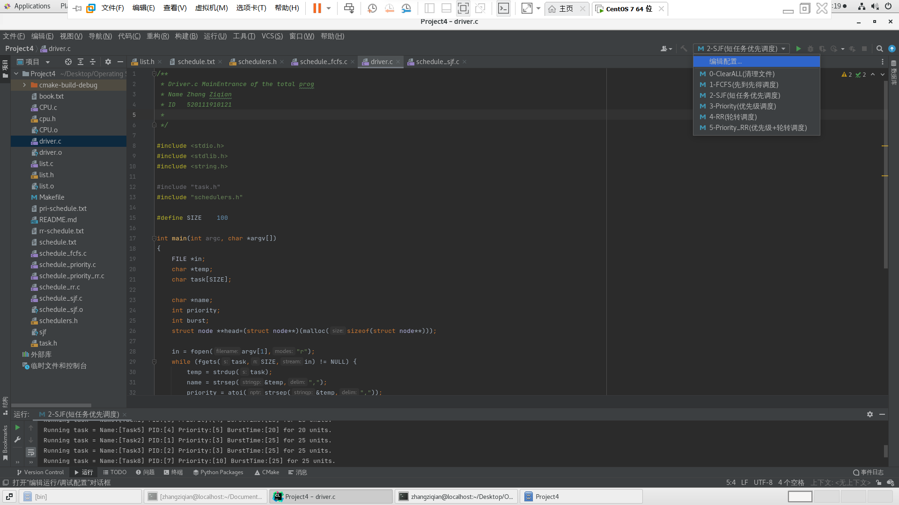
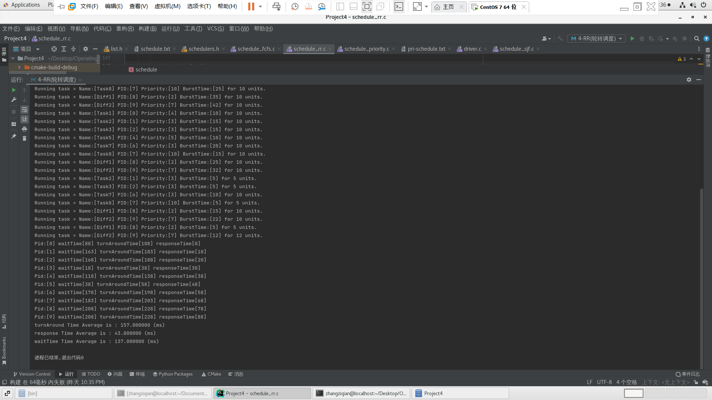
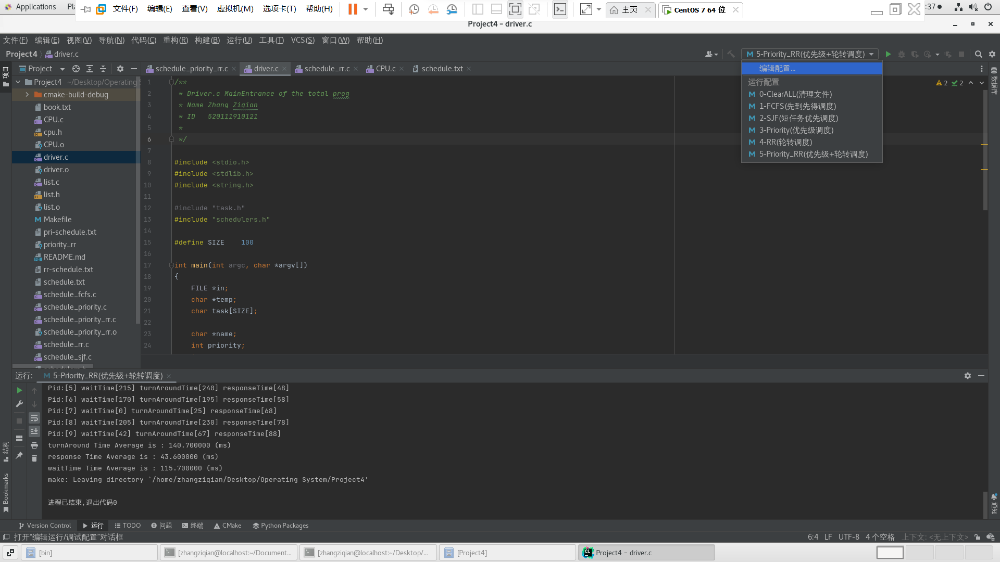
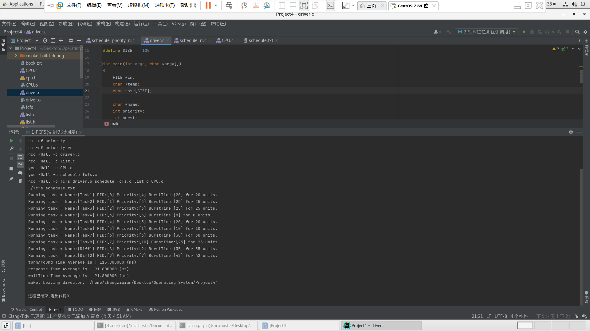
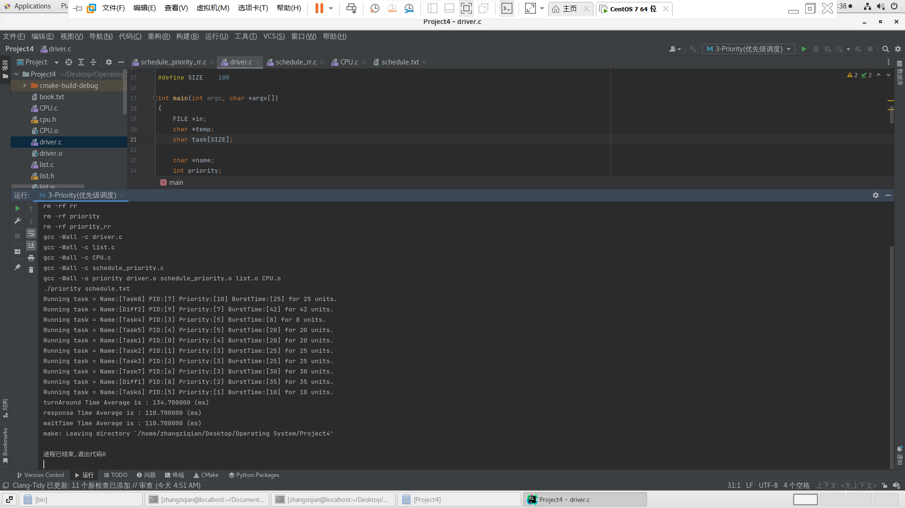
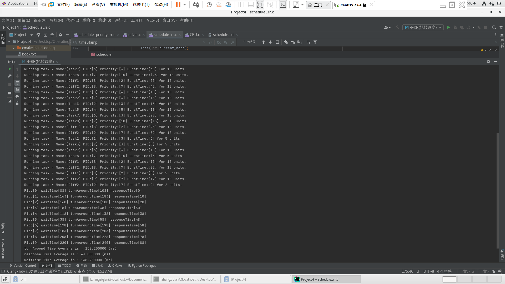
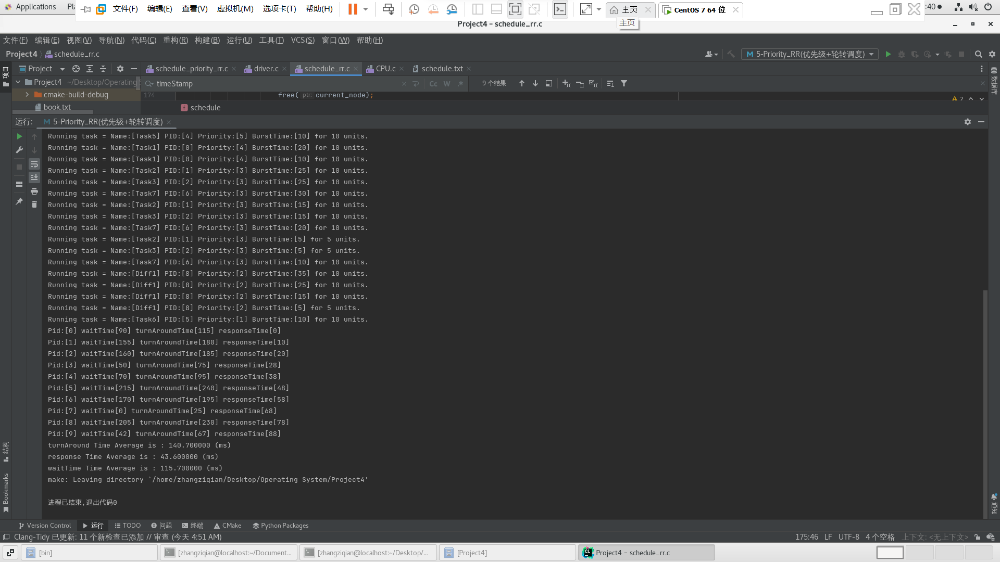

### Project 4 调度算法（完整版含附加题）
> - 姓名：Musicminon
>- 版本：2022-4-26（最终完整版，含代码和附加题）

[TOC]

#### 一、介绍

该项目涉及实现几种不同的进程调度算法。调度程序将被分配一组预定义的任务，并将根据选定的调度算法调度任务。 每个任务都被分配了一个优先级和 CPU 突发。 将实现以下调度算法：

- 先到先服务 (FCFS)，它按照任务请求 CPU 的顺序调度任务。

- 短任务优先(SJF)，按照任务的长度来安排任务任务的下一个 CPU 爆发。

- 优先级调度，根据优先级调度任务。

- 循环 (RR) 调度，其中每个任务运行一个时间量（或其 CPU 突发的剩余部分）。

- Priority 和 round-robin，按优先级顺序调度任务，对同等优先级的任务使用轮询调度


#### 二、输入格式

给出的任务调度的格式为 $[task name] [priority] [CPU burst]$，示例格式如下（教材）：

```
T1, 4, 20
T2, 2, 25
T3, 3, 25
T4, 3, 15
T5, 10, 1
```

- 因此，任务 T1 具有优先级 4 和 20 毫秒的 CPU 突发，依此类推。 假设所有任务同时到达，因此我们的调度程序算法不必支持高优先级进程抢占低优先级进程。 此外，任务不必以任何特定顺序放入队列或列表中。
- 如第 5.1.2 节中首次介绍的那样，有几种不同的策略来组织任务列表。 一种方法是将所有任务放在一个无序单链表中，其中任务选择的策略取决于调度算法。 
- 例如，SJF 调度将搜索列表以找到具有最短下一个 CPU 突发的任务。 或者，可以根据调度标准（即，按优先级）对列表进行排序。 
- 另一种策略是为每个唯一优先级设置一个单独的队列，如图 5.7 所示。 这些方法将在 5.3.6 节中简要讨论。 还值得强调的是，我们使用的术语列表和队列有些互换。 但是，队列具有非常特定的 FIFO 功能，而列表没有如此严格的插入和删除要求。 完成此项目时，您可能会发现通用链表的功能更合适。


#### 三、三个基础类与运行逻辑

可以看到在书籍提供给我们的代码中，有下面的一些文件

```
---src
  |---Task.c
  |---Task.h
  |---cpu.c
  |---cpu.h
  |---driver.h
```


##### 1、Task的作用

为了方便完成任务，定义这样的一个Task结构体，包含的成员是名字、ID、优先级、占用的时间。

```c
#ifndef TASK_H
#define TASK_H
// representation of a task
typedef struct task {
    char *name;
    int tid;
    int priority;
    int burst;
} Task;
#endif
```


##### 2、CPU的作用

在CPU的头文件中，我们定义了一个 `QUANTNUM​` ,这个变量用来表示在轮转调度过程中，每一个任务最大的占用的时间。

```
#define QUANTUM 10
```

同时，我们还定义了一个 `run` 函数，用来表示我们执行了这个任务

```c
// run this task for the specified time slice
void run(Task *task, int slice) {
 	printf("Running task = [%s] [%d] [%d] for %d units.\n",task->name,task->priority, task->burst, slice);
}
```


##### 3、Driver的作用

- `driver.c` 是模拟任务运行的部分。 我们需要读完这部分的所有任务，并将它们传递给调度算法。
- 而我们实际上是使用数据结构链表来存储这些任务的。 更重要的是，我们使用 main() 的参数来传递文件名。 
- 我们使用C的几个函数来实现文件的翻译：

```
strdup()	//复制字符串
strsep()	//从字符串中提取token
atoi()		//将字符串转换为整数
```

- 下面是这个程序的主函数，它将包含文件的读取的一整个系列的工作。

```c
int main(int argc, char *argv[])
{
     FILE *in;
     char *temp;
     char task[SIZE];
     char *name;
     int priority;
     int burst;
     struct node **head=(struct node**)(malloc(sizeof(struct node**)));
     in = fopen(argv[1],"r");
     while (fgets(task,SIZE,in) != NULL) {
         temp = strdup(task);
         name = strsep(&temp,",");
         priority = atoi(strsep(&temp,","));
         burst = atoi(strsep(&temp,","));
         // add the task to the scheduler's list of tasks
         add(name,priority,burst, head);
         free(temp);
     }
     fclose(in);
     // invoke the scheduler
     schedule(head);
     return 0;
}
```


##### 4、程序的逻辑

- 这个程序的逻辑就是，选择不同的调度的库函数，分别来采用不同的算法函数，然后按照这对应的算法函数进行任务链表的产生和计算相关的时间长度。主函数完成的仅仅是文件的读取工作。
- 例如下面是我使用CLion在CentOS上面的截图，五种配置可以随心自由的切换，直接选择对应的调度算法即可使用！当然如果是在服务器上运行，也可以采用传统的命令行，两种方法测试都可以正常输出！




#### 四、FCFS 先到先服务

- 这种调度方法是最简单的方法，它根据任务到达CPU的时间来进行，先请求的前响应，直到解决后，就解决下一个任务。

- 实现方法是一个队列，只需要每次有新的任务要到来的时候，就把这个任务放在这个队伍的末尾，当CPU空闲的时候，就直接拿一个队伍首的任务开始执行，直到队伍为空。
- 但是综合考虑，链表也可以很好的实现这个功能，所以选择链表。

##### 1、链表增元

- 这个函数的功能相当于给链表增加一个节点，也是和之前说的队列末尾增加元素一个道理。

```c
void add(char *name, int priority, int burst, struct node **head){
     Task *t_new = (Task*)malloc(sizeof(Task*));
     t_new->name = name;
     t_new->priority = priority;
     t_new->burst = burst;
     insert(head, t_new);
}
```


##### 2、翻转链表

由于我们每次插入到链表中，都是插入到首部，所以我们对于这个链表需要做一次翻转，完成翻转后，顺序才能正确。

```c
 while(current_node!=NULL && current_node->next!=NULL)
 {
     back_node = current_node->next;
     current_node->next = front_node;
     front_node = current_node;
     current_node = back_node; 
 }
```

对于最后一个的节点，需要特殊考虑，删除代码如下：

```c
if(current_node!=NULL && current_node->next==NULL)
 	current_node->next = front_node;
*head = current_node;
```


##### 3、遍历链表

由于已经翻转了这个链表，直接遍历一下，运行每一个任务就好。

```c
Task *tmp_task;
while(current_node!=NULL)
{
     tmp_task = current_node->task;
     run(tmp_task, tmp_task->burst);// run the task
     current_node = current_node->next;
}
```


#### 五、SJF 短任务优先

- SJF调度算法是考虑进程的长度，当CPU处在空闲的状态，它会选择当然消耗时间最短执行，当然，如果两个任务消耗的时间相同，那么就会按照之前的FCFS原则

- 考虑到这次的任务是要求短任务优先，所以，我们选择在插入的时候找到适合自己的位置。
- 这样完成之后，链表有序，就可以开始执行了。

##### 一、增加元素

- 选择在插入的时候找到适合自己的位置。

```c
void add(char *name, int priority, int burst, struct node **head){
    Task *t_new = (Task*)malloc(sizeof(Task*));
    t_new->name = name;
    t_new->priority = priority;
    t_new->burst = burst;

    struct node *current_node, *front_node;
    current_node = *head;
    front_node = NULL;
    if(current_node==NULL)
    {
        insert(head, t_new);
        return ;
    }
    while(current_node!=NULL)
    {
        if(burst >= current_node->task->burst ){
            front_node = current_node;
            current_node = current_node->next;

        }
        else{
            struct node* node_newtask = malloc(sizeof(struct node));
            node_newtask->task = t_new;
            node_newtask->next = current_node;
            if(front_node==NULL){
                    *head = node_newtask;
            }
            else{
                front_node->next = node_newtask;
            }
            return;
        }
    }
    if(current_node==NULL)
    {
        struct node* node_newtask = malloc(sizeof(struct node));
        node_newtask->task = t_new;
        node_newtask->next = NULL;
        front_node->next = node_newtask;
        return;
    }
}
```

##### 二、调度函数

按照之前排好的顺序执行。

```c
void schedule(struct node **head){
     struct node* current_node;
     current_node = *head;
     while(current_node!=NULL)
     {
         run(current_node->task,current_node->task->burst);
         current_node = current_node->next;
     }
}
```

##### 三、特别注意

- 下面的这一段代码很容易犯错，程序中通常一个等于号的遗漏或者书写，对整个程序的运行逻辑都是巨大的影响
- 因为在时间相同的时候，会按照先来的先处理，后来的后处理，代码是在添加任务的时候，直接把任务放在大小合适的位置，因为在插入的时候，后插入的肯定是后来的，后来的就要放在后面，所以在等于的时候还是要求继续一个`while`循环

```c
if(burst >= current_node->task->burst )
    // do somethings
```


#### 六、优先级调度

- 不难发现，优先级调度和短任务优先调度有异曲同工之妙，因为他们都是比较任务的一个属性，然后来实现一个排序，最后按照这个排序来输出结果。
- 所以，我们需要做的就是改变一个符号、并且改变判断的内容即可

##### 一、增添元素

```c
void add(char *name, int priority, int burst, struct node **head){
    Task *t_new = (Task*)malloc(sizeof(Task*));
    t_new->name = name;
    t_new->priority = priority;
    t_new->burst = burst;

    struct node *current_node, *front_node;
    current_node = *head;
    front_node = NULL;
    if(current_node==NULL)
        {
            insert(head, t_new);
            return ;
        }
    while(current_node!=NULL)
    {
        if(priority < current_node->task->priority ){
            front_node = current_node;
            current_node = current_node->next;

        }
        else{
            struct node* node_newtask = malloc(sizeof(struct node));
            node_newtask->task = t_new;
            node_newtask->next = current_node;
            if(front_node==NULL){
                    *head = node_newtask;
            }
            else{
                front_node->next = node_newtask;
            }
            return;
        }
    }
    if(current_node==NULL)
    {
        struct node* node_newtask = malloc(sizeof(struct node));
        node_newtask->task = t_new;
        node_newtask->next = NULL;
        front_node->next = node_newtask;
        return;
    }
}
```

##### 二、调度执行

```
void schedule(struct node **head){
     struct node* current_node;
     current_node = *head;
     while(current_node!=NULL)
     {
     run(current_node->task,current_node->task->burst);
     current_node = current_node->next;
     }
}
```


#### 七、轮转调度

##### 一、实现说明

- 轮转调度的算法就像FCFS一样，但是每次执行的时候，有一个时间片的限制，一旦任务超出了时间片的限制，就被停止，然后去执行下一个任务。
- 值得注意的是，我们在执行任务的时候，每次执行完，对应的 `bursttime` 要做一个减法，当然，如果这个时间小于那个时间片的限制，就相当于我们把这个任务全部执行完成了，所以时间设置为 0 。
- 我们使用了循环链表，这是一个很好的解决这个问题的算法，完成任务就删除掉这个节点，没有完成就放在那里，下次循环的时候自然会到那里，所以直到链表上面没有元素了那么就可以结束了。

##### 二、相关代码

```c

void add(char *name, int priority, int burst, struct node **head){
    struct node *current_node;
    current_node = *head;
    
    Task *t_new = (Task*)malloc(sizeof(Task*));
    t_new->name = name;
    t_new->priority = priority;
    t_new->burst = burst;

    if(current_node==NULL)
    {
        struct node *new_node = malloc(sizeof(struct node));
        new_node->task = t_new;
        new_node->next = NULL;
        *head = new_node;
        return;
    }
    while((current_node->next)!=NULL)
    {
        current_node=current_node->next;
    }
    if((current_node->next)==NULL)
    {
        struct node *new_node = malloc(sizeof(struct node));
        new_node->task = t_new;
        new_node->next = NULL;
        current_node->next = new_node;
        return;
    }

}


void schedule(struct node **head){
    int quantum = QUANTUM;
    struct node* current_node, *front_node;
    current_node = *head;
    front_node = NULL;
    // get tail node
    while((current_node->next)!=NULL)
    {
        current_node = current_node->next;
    }
    current_node->next = *head;
    // change into circular list
    
    current_node = *head;
    while(current_node!=NULL)
    {
        if(current_node->task->burst <= quantum)
        {
            run(current_node->task, current_node->task->burst);
            struct node *tmp;
            tmp = front_node->next;

            if(front_node!=NULL)
            {
            
                front_node->next = current_node->next;
                current_node = current_node->next;
                if(current_node->next == current_node)
                {
                    run(current_node->task, current_node->task->burst);
                    return;
                }
                free(tmp);
                continue;
            }
        }
        else
        {
            run(current_node->task, quantum);
            current_node->task->burst -= quantum;
        }   
        front_node = current_node;
        current_node = current_node->next;
        
    }
}


```


#### 八、优先级-轮转调度

##### 一、原理介绍

- 这种调度方法结合了轮转和优先级的调度。
  - 将链表中相同优先级的部分转化为循环链表
  - 在这个循环列表上运行 round_robin()
  - 转向运行下一级优先级列表

##### 二、代码演示

```c
void schedule(struct node **head){

    //int quantum = QUANTUM;
    
    struct node* current_node;
    current_node = *head;

    struct node** circular_list_head=malloc(sizeof(struct node*));
    // struct node** circular_list_tail=malloc(sizeof(struct node*));
    struct node* current_circular_node=malloc(sizeof(struct node));
    current_circular_node = NULL;
    
    while(current_node!=NULL)
    {
        if(current_circular_node==NULL)
        {
            current_circular_node = current_node;
            *circular_list_head = current_node;
            //printf("!!!%d\n", current_circular_node->task->priority);
            current_node = current_node->next;
            
            continue;
        }

        if(current_node->task->priority==current_circular_node->task->priority)
        {
            current_circular_node = current_circular_node->next;
            current_node = current_node->next;
            
            continue;
        }
        else
        {
            // a level of priority has been found out
            *head = current_node;
            current_circular_node->next = NULL;
            round_robin(circular_list_head);
            // clear the list
            *circular_list_head = NULL;
            current_circular_node = *circular_list_head;
        }
    }
    if(current_circular_node!=NULL)
    {
        round_robin(circular_list_head);
    }

}
```

#### 九、附加挑战题

> 在课本的后面给出了两个挑战题目，第一道题是给每一个任务分配一个编号ID，但是考虑到可能出现竞争状态，所以要使用原子整数。第二题是一个计算题，要求计算每一个算法的一些时间周期。考虑到整个项目的量非常的大，所以这里简答说明第一题，详细说明第二题。

##### 一、附加题（1）

- 在Linux和MacOS系统上，`__sync_fetch_add()`函数可用于原子上增加整数值。例如，以下代码示例原子上将值递增1：

```c
int value = 0;
__sync_fetch_and_add(&value,1);
```

解决方法：

- 定义一个全局变量 `pidNum = 0` ，初始化为 0。

- 每次有新来的任务的时候，执行下面的语句，这样可以给这个数据加一个保护锁，在执行加减的时候避免其他新来的进程干扰，从而避免两个任务同时到达的时候，pid可能出现相同的情况。

- ```c
  void add(char *name, int priority, int burst, struct node **head){
      pthread_mutex_t lock;
      pthread_mutex_init(&lock,NULL);
      pthread_mutex_lock(&lock);
      
      Task *t_new = (Task*)malloc(sizeof(Task*));
      t_new->name = name;
      t_new->priority = priority;
      t_new->tid = taskSize;
      taskSize++;
      t_new->burst = burst;
      insert(head, t_new);
      pthread_mutex_unlock(&lock);
  }
  ```

- 代码中经过修改也已经体现这个过程。


##### 二、附加题（2）

###### a) 概念复习

- 响应时间：从提交第一个请求到产生第一个响应所用时间。
- 周转时间：从作业提交到作业完成的时间间隔。
- 等待时间：在等待队列里面的时间。

###### b) FCFS调度算法 时间计算

- 要计算平均周转时间、平均等待时间、平均响应时间：绘制甘特图，结果如下，第一行表示任务，第二行表示时间

| $P_0$ | $P_1$ | $P_2$ | $P_3$ |      | $P_{size-1}$ |
| :---: | :---: | :---: | :---: | ---- | :----------: |
| $a_0$ | $a_1$ | $a_2$ | $a_3$ |      | $a_{size-1}$ |

- 那么，**经过iPad上面的一通计算猛如虎（别问，问就是缺纸）**，有下面的**公式**可以使用：

$$
平均等待时间 = \frac{(size-1) \times a_0+(size-2) \times a_1 + \dots +2 \times a_{size-3} + 1 \times a_{size-2} }{size}
$$

$$
平均响应时间 = \frac{(size-1) \times a_0+(size-2) \times a_1 + \dots +2 \times a_{size-3} + 1 \times a_{size-2} }{size}
$$

$$
平均周转时间 = \frac{(size) \times a_0+(size-1) \times a_1 + \dots +2 \times a_{size-2} + 1 \times a_{size-1} }{size}
$$

- 为了针对性的解决问题，我们定义一个数组，把这个链表的$burstTime$时间从头到尾遍历一下，然后代入这个计算公式。
- 显然这个函数具有很强的通用性，因为SJF还有优先级调度都可以用这个算法，为什么呢，因为他们在操作的时候都是执行的排序+输出执行的操作，我们进行的只不过是在执行之前多了一个预计算的过程，所以不会改变链表，也非常具有通用性。

```c
// 接收一个链表，然后计算
void timeCalculator(struct node **head){
    if(taskSize > 0){
        double turnAroundTime = 0;
        double waitTime = 0;
        double responseTime = 0;

        int timeArray[taskSize];
        int i;

        struct node *current_node;
        current_node = *head;

        for(i=0; i<taskSize; i++){
            timeArray[i] = current_node->task->burst;
            current_node = current_node->next;

            turnAroundTime += (taskSize - i) * timeArray[i];
            responseTime += (taskSize - i - 1) * timeArray[i];
            waitTime += (taskSize - i - 1) * timeArray[i];

            //printf("%d\t", timeArray[i]);
        }

        printf("turnAround Time Average is : %lf (ms)\n",turnAroundTime /taskSize);
        printf("response Time Average is : %lf (ms)\n ",responseTime /taskSize);
        printf("waitTime Time Average is : %lf (ms)\n",waitTime /taskSize);

    }
}
```


###### c) SJF调度算法 时间计算

- 国际惯例，遇事不决先抄公式，显然这两个算法是一样的，直接套公式即可。

$$
平均等待时间 = \frac{(size-1) \times a_0+(size-2) \times a_1 + \dots +2 \times a_{size-3} + 1 \times a_{size-2} }{size}
$$

$$
平均响应时间 = \frac{(size-1) \times a_0+(size-2) \times a_1 + \dots +2 \times a_{size-3} + 1 \times a_{size-2} }{size}
$$

$$
平均周转时间 = \frac{(size) \times a_0+(size-1) \times a_1 + \dots +2 \times a_{size-2} + 1 \times a_{size-1} }{size}
$$


###### d) 优先级调度 时间计算

- 方法和上面的是一模一样的，函数具有通用性，至少在这三个里面是通用的。


###### e) RR调度 时间计算（难）

- 要计算这种类型的平均时间，是一件非常麻烦的事情。因为在轮转中存在这样的现象：

- ```
  # 对于每一个任务来说，可能经过下面的过程
  |任务到达-----等待中-----|<执行任务>|---------等待中-------|执行任务并完成|
  |<------响应时间------->|
  |<-----------------------------周转时间---------------------------->|
  |<------等待时间1------>|<任务时间>|<------等待时间2----->|<--任务时间-->
  ```

- 所以，经过我细心的观察，发现，对于每一个任务来说，$周转时间-burstTime=等待时间总和$。
- 这时候就要优化代码了，首先我们要设置全局变量、时间戳等信息。
  - 在执行一个任务剩余时间大于时间片区单位的时候，时间戳要加上轮转的时间片长度
  - 在执行一个任务剩余时间小于或等于时间片区单位的时候，说明这个任务马上完结撒花，就可以时间戳加上任务剩余时间。
  - 当然，对于时间戳操作也可以用锁，但是为了节约代码量，这里不做代码修改。

- 在某个任务要终结的时候，执行完后，要把当前的时间戳写入任务对应ID的数组（周转时间数组）中。
- 在初始化等待时间数组的时候，可以把每个任务的bursttime时间先写入，这样可以节约空间，而不是另外的申请一个数组来保存时间信息。

```c
#include "schedulers.h"
#include "cpu.h"
#include <stdio.h>
#include <stdlib.h>


int* turnAroundTime;
int* waitTime;
int* responseTime;

int timeStamp = 0;
int taskSize = 0;

double turnAroundTimeAvg = 0;
double waitTimeAvg = 0;
double responseTimeAvg = 0;


void initArray(struct node **head){
    turnAroundTime = (int*) malloc(sizeof(int) * taskSize);
    waitTime = (int*) malloc(sizeof(int) * taskSize);
    responseTime = (int*) malloc(sizeof(int) * taskSize);

    int i;
    struct node *current_node;
    current_node = *head;

    for (i = 0; i < taskSize; i++) {
        turnAroundTime[i] = 0;
        responseTime[i] = 0;
        waitTime[i] = current_node->task->burst;
    }
}

void freeArray(){
    free(turnAroundTime);
    free(waitTime);
    free(responseTime);
}


void responseTimeCalculator(struct node **head){
    if(taskSize > 0){
        struct node *current_node;
        current_node = *head;
        int sumTmp = 0;
        int i;

        for(i=0; i<taskSize; i++){
            responseTime[i] = sumTmp;
            if(current_node->task->burst < QUANTUM)
                sumTmp += current_node->task->burst;
            else
                sumTmp += QUANTUM;
            responseTimeAvg += responseTime[i];

            current_node = current_node->next;
        }
    }
}

void timeCalculator(struct node **head) {
    int i;
    for (i = 0; i < taskSize; i++) {
        waitTime[i] = turnAroundTime[i] - waitTime[i];
        waitTimeAvg += waitTime[i];
        turnAroundTimeAvg += turnAroundTime[i];

        printf("Pid:[%d] waitTime[%d] turnAroundTime[%d] responseTime[%d] \n",i,waitTime[i],turnAroundTime[i],responseTime[i]);
    }

    printf("turnAround Time Average is : %lf (ms)\n",turnAroundTimeAvg /taskSize);
    printf("response Time Average is : %lf (ms)\n",responseTimeAvg /taskSize);
    printf("waitTime Time Average is : %lf (ms)\n",waitTimeAvg /taskSize);
}


void add(char *name, int priority, int burst, struct node **head){
    struct node *current_node;
    current_node = *head;

    pthread_mutex_t lock;
    pthread_mutex_init(&lock,NULL);
    pthread_mutex_lock(&lock);


    Task *t_new = (Task*)malloc(sizeof(Task*));
    t_new->name = name;
    t_new->priority = priority;
    t_new->burst = burst;
    t_new->tid = taskSize;
    taskSize++;

    pthread_mutex_unlock(&lock);

    if(current_node==NULL)
    {
        struct node *new_node = malloc(sizeof(struct node));
        new_node->task = t_new;
        new_node->next = NULL;
        *head = new_node;
        return;
    }

    while((current_node->next)!=NULL)
    {
        current_node=current_node->next;
    }
    if((current_node->next)==NULL)
    {
        struct node *new_node = malloc(sizeof(struct node));
        new_node->task = t_new;
        new_node->next = NULL;
        current_node->next = new_node;
        return;
    }

}


void schedule(struct node **head){
    initArray(head);
    responseTimeCalculator(head);

    int quantum = QUANTUM;
    struct node* current_node, *front_node;
    current_node = *head;
    front_node = NULL;
    // get tail node
    while((current_node->next)!=NULL)
    {
        current_node = current_node->next;
    }
    current_node->next = *head;
    // change into circular list
    current_node = *head;
    while(current_node!=NULL)
    {
        if(current_node->task->burst <= quantum)
        {
            timeStamp += current_node->task->burst;
            run(current_node->task, current_node->task->burst);
            turnAroundTime[current_node->task->tid] = timeStamp;
            current_node->task->burst = 0;

            struct node *tmp;

            if(front_node!=NULL)
            {
                tmp = front_node->next;
                front_node->next = current_node->next;
                current_node = current_node->next;
                if(current_node->next == current_node)
                {
                    if(current_node->task->burst <= quantum){
                        run(current_node->task, current_node->task->burst);
                        timeStamp += current_node->task->burst;
                        current_node->task->burst -= quantum;
                        turnAroundTime[current_node->task->tid] = timeStamp;
                        return;
                    }
                    else{
                        while(current_node->task->burst > quantum){
                            run(current_node->task, quantum);
                            timeStamp+=quantum;
                            current_node->task->burst -= quantum;
                        }
                        run(current_node->task, current_node->task->burst);
                        timeStamp+=current_node->task->burst;
                        current_node->task->burst -= quantum;
                        
                        turnAroundTime[current_node->task->tid] = timeStamp;
                        free(current_node);
                        return;

                    }

                    timeCalculator(head);
                    return;
                }
                free(tmp);
                continue;
            }
        }
        else
        {
            timeStamp += quantum;
            run(current_node->task, quantum);
            current_node->task->burst -= quantum;
        }   
        front_node = current_node;
        current_node = current_node->next;
    }
}
```

- 效果展示




###### f) 优先级-RR调度 时间计算

**特别顺序警告：**

- 代码的顺序必须是：
  - run函数！
  - 操作当然时间戳！
  - 修改任务的剩余时间！

仅有下面两种是正确的！！！

```
run(current_node->task, current_node->task->burst);
timeStamp+=current_node->task->burst;
current_node->task->burst -= quantum;
```

```
timeStamp+=current_node->task->burst;
run(current_node->task, current_node->task->burst);
current_node->task->burst -= quantum;
```

和之前的算法类似，所以贴一下代码！

```c
#include "schedulers.h"
#include "cpu.h"
#include <stdio.h>
#include <stdlib.h>

int* turnAroundTime;
int* waitTime;
int* responseTime;

int timeStamp = 0;
int taskSize = 0;

double turnAroundTimeAvg = 0;
double waitTimeAvg = 0;
double responseTimeAvg = 0;

void initArray(struct node **head){
    turnAroundTime = (int*) malloc(sizeof(int) * taskSize);
    waitTime = (int*) malloc(sizeof(int) * taskSize);
    responseTime = (int*) malloc(sizeof(int) * taskSize);

    int i;
    struct node *current_node;
    current_node = *head;

    for (i = 0; i < taskSize; i++) {
        turnAroundTime[i] = 0;
        responseTime[i] = 0;
        waitTime[i] = current_node->task->burst;
    }
}

void freeArray(){
    free(turnAroundTime);
    free(waitTime);
    free(responseTime);
}

void responseTimeCalculator(struct node **head){
    if(taskSize > 0){
        struct node *current_node;
        current_node = *head;
        int sumTmp = 0;
        int i;

        for(i=0; i<taskSize; i++){
            responseTime[i] = sumTmp;
            if(current_node->task->burst < QUANTUM)
                sumTmp += current_node->task->burst;
            else
                sumTmp += QUANTUM;
            responseTimeAvg += responseTime[i];

            current_node = current_node->next;
        }
    }
}

void timeCalculator(struct node **head) {
    int i;
    for (i = 0; i < taskSize; i++) {
        waitTime[i] = turnAroundTime[i] - waitTime[i];
        waitTimeAvg += waitTime[i];
        turnAroundTimeAvg += turnAroundTime[i];

        printf("Pid:[%d] waitTime[%d] turnAroundTime[%d] responseTime[%d] \n",i,waitTime[i],turnAroundTime[i],responseTime[i]);
    }

    printf("turnAround Time Average is : %lf (ms)\n",turnAroundTimeAvg /taskSize);
    printf("response Time Average is : %lf (ms)\n",responseTimeAvg /taskSize);
    printf("waitTime Time Average is : %lf (ms)\n",waitTimeAvg /taskSize);
}


void add(char *name, int priority, int burst, struct node **head){
    pthread_mutex_t lock;
    pthread_mutex_init(&lock,NULL);
    pthread_mutex_lock(&lock);


    Task *t_new = (Task*)malloc(sizeof(Task*));
    t_new->name = name;
    t_new->priority = priority;
    t_new->burst = burst;
    t_new->tid = taskSize;
    taskSize++;

    pthread_mutex_unlock(&lock);

    struct node *current_node, *front_node;
    current_node = *head;
    front_node = NULL;
    if(current_node==NULL)
    {
        insert(head, t_new);
        return ;
    }
    while(current_node!=NULL)
    {
        if(priority <= current_node->task->priority ){
            front_node = current_node;
            current_node = current_node->next;
        }
        else{
            struct node* node_newtask = malloc(sizeof(struct node));
            node_newtask->task = t_new;
            node_newtask->next = current_node;
            if(front_node==NULL){
                    *head = node_newtask;
            }
            else{
                front_node->next = node_newtask;
            }
            return;
        }
    }
    if(current_node==NULL)
    {
        struct node* node_newtask = malloc(sizeof(struct node));
        node_newtask->task = t_new;
        node_newtask->next = NULL;
        front_node->next = node_newtask;
        return;
    }
}

void round_robin(struct node **head){
    int quantum = QUANTUM;
    struct node* current_node, *front_node;
    current_node = *head;
    front_node = NULL;
    // get tail node
    while((current_node->next)!=NULL)
    {
        current_node = current_node->next;
    }
    current_node->next = *head;// change into circular list

    // front_node init val is tail_node
    front_node = current_node;
    // current_node now is head_node
    current_node = *head;

    //special situation
    if(current_node->next==current_node)
    {
        int time = current_node->task->burst;
        while(time > quantum)
        {
            run(current_node->task, quantum);
            timeStamp +=quantum;
            current_node->task->burst -= quantum;
            time = current_node->task->burst;
        }
        run(current_node->task, current_node->task->burst);
        timeStamp += current_node->task->burst;
        turnAroundTime[current_node->task->tid] = timeStamp;

        free(current_node);
        return;
    }

    while(current_node!=NULL)
    {
        if(current_node->task->burst <= quantum)
        {
            run(current_node->task, current_node->task->burst);
            timeStamp += current_node->task->burst;
            current_node->task->burst = 0;
            turnAroundTime[current_node->task->tid] = timeStamp;

            struct node *tmp;
            // Now, it's important to remove this node
            if(front_node!=NULL)
            {
                tmp = front_node->next;
                front_node->next = current_node->next;
                current_node = current_node->next;
                if(current_node->next == current_node)
                {
                    if(current_node->task->burst <= quantum){
                        run(current_node->task, current_node->task->burst);
                        timeStamp += current_node->task->burst;
                        current_node->task->burst = 0;
                        turnAroundTime[current_node->task->tid] = timeStamp;
                        free(current_node);
                        return;
                    }
                    else{
                        while(current_node->task->burst > quantum){
                            run(current_node->task, quantum);
                            timeStamp +=quantum;
                            current_node->task->burst -= quantum;
                        }

                        run(current_node->task, current_node->task->burst);
                        timeStamp += current_node->task->burst;
                        current_node->task->burst = 0;

                        turnAroundTime[current_node->task->tid] = timeStamp;
                        free(current_node);
                        return;
                    }
                }
                free(tmp);
                continue;
            }
        }
        else
        {
            run(current_node->task, quantum);
            timeStamp += quantum;
            current_node->task->burst -= quantum;
        }   
        front_node = current_node;
        current_node = current_node->next;
    }
}


void schedule(struct node **head){
    initArray(head);
    responseTimeCalculator(head);

    //int quantum = QUANTUM;
    
    struct node* current_node;
    current_node = *head;

    struct node** circular_list_head=malloc(sizeof(struct node*));
    // struct node** circular_list_tail=malloc(sizeof(struct node*));
    struct node* current_circular_node;
    current_circular_node = NULL;
    
    while(current_node!=NULL)
    {
        if(current_circular_node==NULL)
        {
            current_circular_node = current_node;
            *circular_list_head = current_node;
            //printf("!!!%d\n", current_circular_node->task->priority);
            current_node = current_node->next;
            continue;
        }

        if(current_node->task->priority==current_circular_node->task->priority)
        {
            current_circular_node = current_circular_node->next;
            current_node = current_node->next;
            continue;
        }
        else
        {
            // a level of priority has been found out
            *head = current_node;
            current_circular_node->next = NULL;
            round_robin(circular_list_head);
            // clear the list
            *circular_list_head = NULL;
            current_circular_node = *circular_list_head;

        }
    }
    if(current_circular_node!=NULL)
    {
        round_robin(circular_list_head);
    }
    timeCalculator(head);
}


```


#### 十、归纳总结

- 这几种算法都是非常重要的调度算法，不仅是操作系统中的应用广泛，在一些服务器系统也很常见。
- 通过这次的练习，复习了我们之前学习过的一些基础的数据结构（例如链表等等），此外对这些基本调度的算法，也有了更加深刻的认识。
- 这个Project的代码量稍微有一些多，但是好在一些基础的代码已经给我们提供了，例如解析输入的内容，所以只需要完成核心的内容部分，所以设计也比较合理。
- 最后一个挑战题目特别有意思，很值得挑战！！受益匪浅！！


#### 十一、效果演示图

- 配置随心选



- FCFS演示图


- SJF



- 优先级



- RR



- 优先级-RR

