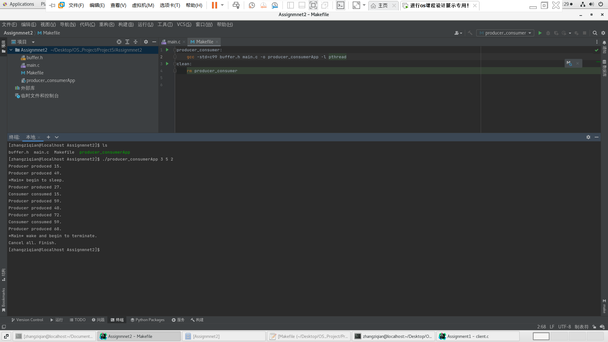

### Project 5  线程池和生产者消费者问题

> - 姓名：Musicminion
>- 版本：2022-5-6


[TOC]


#### 一、简介背景

- 这一章节的项目是要完成一个线程池，并利用锁完成一个对生产者消费者问题的解决，整体说来任务不是特别的复杂，只要理解了锁的概念，操作起来非常容易。

- 线程池的任务是模拟一个客户端和一个响应客户端请求的线程池，前者（也就是客户端）不断的提交任务，后者不断的解决问题，当然后者的线程的资源数目优先，比如只有十个，所以同时运行的就是只有十个。换个思路来说，我们可以把线程池想象成为一个拥有例如十个打印机的资源库，不断的有用户申请来打印，但是我同时只能打印十个作业，这个时候就需要合理的调度，有任务来就要把空的打印机给这个任务，没有空的就要等待。
- 生产者消费者是一个老生常谈的问题，例如，生产者不断的生产资源，消费者不断的消费资源，我们的任务是创建若干个消费者，若干个生产者，让这个过程运行一段时间，然后停止即可。在这个过程也要灵活的运用锁。


#### 二、线程池任务

##### 1、函数接口简介

- `pool_init()`  这个函数要完成线程池的初始化的工作。
- ` pool_submit()` 这个函数接收任务参数，会被主函数的客户端调用，用来不断的提交任务。`pool_submit() `函数已部分实现，当前将要执行的函数及其数据放入任务结构中。 任务结构表示将由池中的线程完成的工作。 `pool_submit()` 将通过调用 `enqueue()` 函数将这些任务添加到队列中，并且工作线程将调用 dequeue() 从队列中检索工作。 队列可以静态（使用数组）或动态（使用链表）实现。 `pool_init()` 函数有一个 `int` 返回值，用于指示任务是否成功提交到池中（0 表示成功，1 表示失败）。 如果队列是使用数组实现的，如果尝试提交工作并且队列已满，`pool_init()` 将返回 1。 如果队列实现为链表，则 `pool_init() `应始终返回 0，除非发生内存分配错误。

- `worker()` 函数由池中的每个线程执行，每个线程将等待可用的工作。 一旦工作变得可用，线程将从队列中删除它并调用` execute() `来运行指定的函数。
- `worker() `函数由池中的每个线程执行，每个线程将等待可用的工作。 一旦工作变得可用，线程将从队列中删除它并调用 `execute() `来运行指定的函数。 当工作提交到线程池时，信号量可用于通知等待线程。 可以使用命名或未命名的信号量。 有关使用 POSIX 信号量的更多详细信息，请参阅第 7.3.2 节。
- 在访问或修改队列时，必须使用互斥锁来避免竞争条件。 （第 7.3.1 节提供了有关 Pthread 互斥锁的详细信息。）
- `pool shutdown() `函数将取消每个工作线程，然后通过调用 `pthread_join()` 等待每个线程终止。 有关 POSIX 线程取消的详细信息，请参阅第 4.6.3 节。 （信号量操作` sem_wait() `是一个取消点，允许取消等待信号量的线程。）

##### 2、实现原理介绍

###### a) 函数 `int enqueue(task t) ` 实现

```c
int enqueue(task t)
{
    if (length == QUEUE_SIZE)
        return 1;
    pthread_mutex_lock(&mutex);
    work_queue[length] = t;
    length++;
    pthread_mutex_unlock(&mutex);
    return 0;
}
```

- 入队的过程首先要检查是不是超过范围了，超过范围直接返回1，让多余的任务等待
- 然后就是会进入临界区的代码。
- 把队伍尾巴的元素赋值。
- 然后最后解锁，说明已经入队成功！


###### b) 函数 `task dequeue() ` 实现

```c
task dequeue()
{
    task worktodo;
    if (length == 0)
    {
        worktodo.data = NULL;
        worktodo.function = NULL;
    }
    else
    {
        pthread_mutex_lock(&mutex);
        worktodo = work_queue[0];
        length--;
        for (int i = 0; i < length; ++i)
            work_queue[i] = work_queue[i + 1];
        work_queue[length].function = NULL;
        work_queue[length].data = NULL;
        pthread_mutex_unlock(&mutex);
    }
    return worktodo;
}
```

- 出队的函数是按照下面的过程：
- 首先，检查是否长度为0，元素没有的话就返回一个空的值
- 否则，就会把队伍首部的元素返回，同时，利用一个`for` 循环把元素都往前面移动一个位数！
- 移动过程的代码属于是临界区的代码，所以必须要加锁！
- 此外，要把即将做的任务  `worktodo`准备充分


###### c) 函数 `void *worker(void *param) ` 实现

```c
// the worker thread in the thread pool
void *worker(void *param)
{
    while(1)
    {
        sem_wait(&semaphore);
        if(on == 0)
            pthread_exit(0);
        cu_task = dequeue();
        execute(cu_task.function, cu_task.data);
    }
}
```

- 首先要检查线程池子是否已经打开，如果没有打开，就退出
- 然后，利用之前我们写过的函数 `dequeue` 来获取队伍首的元素！
- 然后利用获取的元素，利用 `execute` 函数执行任务
- 这个函数就是一个不断运行的函数，检查有没有可以执行的任务。
- semaphore是一个信号量，表示忙碌的机器的数量，sem_wait执行的是减一操作


###### d) 函数 `int pool_submit(void (*somefunction)(void *p), void *p) ` 实现

```c
int pool_submit(void (*somefunction)(void *p), void *p)
{
    task worktodo;
    worktodo.function = somefunction;
    worktodo.data = p;
    int f = enqueue(worktodo);
    while (f)
        f = enqueue(worktodo);
    sem_post(&semaphore);
    return 0;
}
```

- 提交任务的过程是：把todo赋值，然后传递给入队函数
- sem_post执行的是加一操作，说明忙碌机器的个数又增加了


###### e) 线程池初始化函数和终止函数实现

```c
// initialize the thread pool
void pool_init(void)
{
    length = 0;
    on = 1;
    sem_init(&semaphore, 0, 0);
    pthread_mutex_init(&mutex, NULL);
    for (int i = 0; i < NUMBER_OF_THREADS; i++)
        pthread_create(&thread_pool[i], NULL, worker, NULL);
}

// shutdown the thread pool
void pool_shutdown(void)
{
    on = 0;
    for (int i = 0; i < NUMBER_OF_THREADS; i++)
        sem_post(&semaphore);
    for (int i = 0; i < NUMBER_OF_THREADS; i++)
        pthread_join(thread_pool[i], NULL);
    pthread_mutex_destroy(&mutex);
    sem_destroy(&semaphore);
}
```

- 一些基本的的加锁和消除锁的操作。


###### f) 完整代码

- makefile

```
# makefile for thread pool
#

CC=gcc
CFLAGS=-Wall
CFLAGS += -std=c99
PTHREADS=-lpthread

all: client.o threadpool.o
	$(CC) $(CFLAGS) -o example client.o threadpool.o $(PTHREADS)

client.o: client.c
	$(CC) $(CFLAGS) -c client.c $(PTHREADS)

threadpool.o: threadpool.c threadpool.h
	$(CC) $(CFLAGS) -c threadpool.c $(PTHREADS)

clean:
	rm -rf *.o
	rm -rf example
```

- 接口文件

```c
// function prototypes
// threadpool.h
    void execute(void (*somefunction)(void *p), void *p);
    int pool_submit(void (*somefunction)(void *p), void *p);
    void *worker(void *param);
    void pool_init(void);
    void pool_shutdown(void);

```

- 实现代码

```c
/**
 * Implementation of thread pool.
 */

#include <pthread.h>
#include <stdlib.h>
#include <stdio.h>
#include <semaphore.h>
#include "threadpool.h"

#define QUEUE_SIZE 10000
#define NUMBER_OF_THREADS 3

#define TRUE 1

// this represents work that has to be
// completed by a thread in the pool
typedef struct
{
    void (*function)(void *p);
    void *data;
}
        task;

task cu_task;
pthread_t thread_pool[NUMBER_OF_THREADS];
task work_queue[QUEUE_SIZE];
pthread_mutex_t mutex;
sem_t semaphore;
int length;
int on;

// insert a task into the queue
// returns 0 if successful or 1 otherwise,
int enqueue(task t)
{
    if (length == QUEUE_SIZE)
        return 1;
    pthread_mutex_lock(&mutex);
    work_queue[length] = t;
    length++;
    pthread_mutex_unlock(&mutex);
    return 0;
}

// remove a task from the queue
task dequeue()
{
    task worktodo;
    if (length == 0)
    {
        worktodo.data = NULL;
        worktodo.function = NULL;
    }
    else
    {
        pthread_mutex_lock(&mutex);
        worktodo = work_queue[0];
        length--;
        for (int i = 0; i < length; ++i)
            work_queue[i] = work_queue[i + 1];
        work_queue[length].function = NULL;
        work_queue[length].data = NULL;
        pthread_mutex_unlock(&mutex);
    }
    return worktodo;
}

// the worker thread in the thread pool
void *worker(void *param)
{
    while(1)
    {
        sem_wait(&semaphore);
        if(on == 0)
            pthread_exit(0);
        cu_task = dequeue();
        execute(cu_task.function, cu_task.data);
    }
}

/**
 * Executes the task provided to the thread pool
 */
void execute(void (*somefunction)(void *p), void *p)
{
    (*somefunction)(p);
}

/**
 * Submits work to the pool.
 */
int pool_submit(void (*somefunction)(void *p), void *p)
{
    task worktodo;
    worktodo.function = somefunction;
    worktodo.data = p;
    int f = enqueue(worktodo);
    while (f)
        f = enqueue(worktodo);
    sem_post(&semaphore);
    return 0;
}

// initialize the thread pool
void pool_init(void)
{
    length = 0;
    on = 1;
    sem_init(&semaphore, 0, 0);
    pthread_mutex_init(&mutex, NULL);
    for (int i = 0; i < NUMBER_OF_THREADS; i++)
        pthread_create(&thread_pool[i], NULL, worker, NULL);
}

// shutdown the thread pool
void pool_shutdown(void)
{
    on = 0;
    for (int i = 0; i < NUMBER_OF_THREADS; i++)
        sem_post(&semaphore);
    for (int i = 0; i < NUMBER_OF_THREADS; i++)
        pthread_join(thread_pool[i], NULL);
    pthread_mutex_destroy(&mutex);
    sem_destroy(&semaphore);
}
```

- 主函数

```c
/**
 * Example client program that uses thread pool.
 */

#include <stdio.h>
#include <unistd.h>
#include <stdlib.h>
#include <pthread.h>
#include "threadpool.h"

#define QUEUE_SIZE 600

int global_taskNumber = 0;
pthread_mutex_t ID_lock;


struct data
{
    int a;
    int b;
    int clientID;
    int taskID;
};

struct data* pointerGroup[6];

void add(void *param)
{
    struct data *temp;
    temp = (struct data*)param;
    printf("[Info] FINISH: From Client ID:%d Task ID: %d Task Content: %d + %d = %d \n", temp->clientID,temp->taskID, temp->a, temp->b, temp->a + temp->b);
}


static void * submitTaskClient(int idClient){
    //static struct data work1[2 * QUEUE_SIZE];
    struct data* work1 = (struct data*)malloc(2*QUEUE_SIZE * sizeof(struct data));

    pointerGroup[idClient] = work1;
    for (int i = 0; i < 2 * QUEUE_SIZE; i++)
    {
        work1[i].a = rand()%10000;
        work1[i].b = rand()%10000;
        work1[i].clientID = idClient;
        pthread_mutex_lock(&ID_lock);
        global_taskNumber++;
        work1[i].taskID = global_taskNumber;
        printf("[Info] SUBMIT: ClientID: %d submit Global-TaskID %d\n",idClient, work1[i].taskID);
        pthread_mutex_unlock(&ID_lock);

        pool_submit(&add, &work1[i]);
    }
}

int main(void)
{
    pthread_t tid1, tid2, tid3, tid4, tid5, tid6;
    pthread_attr_t attr1, attr2, attr3, attr4, attr5, attr6;
    pthread_attr_init(&attr1);
    pthread_attr_init(&attr2);
    pthread_attr_init(&attr3);
    pthread_attr_init(&attr4);
    pthread_attr_init(&attr5);
    pthread_attr_init(&attr6);


    pool_init();


    pthread_mutex_init(&ID_lock,NULL);

    // create some work to do
//    pthread_create(&tid1, &attr1, submitTaskClient1,NULL);
//    pthread_create(&tid2, &attr2, submitTaskClient2,NULL);
//    pthread_create(&tid3, &attr3, submitTaskClient3,NULL);

    pthread_create(&tid1, &attr1, submitTaskClient,1);
    pthread_create(&tid2, &attr2, submitTaskClient,2);
    pthread_create(&tid3, &attr3, submitTaskClient,3);
    pthread_create(&tid4, &attr4, submitTaskClient,4);
    pthread_create(&tid5, &attr5, submitTaskClient,5);
    pthread_create(&tid6, &attr6, submitTaskClient,6);


    pthread_join(tid1, NULL);
    pthread_join(tid2, NULL);
    pthread_join(tid3, NULL);
    pthread_join(tid4, NULL);
    pthread_join(tid5, NULL);
    pthread_join(tid6, NULL);

    pthread_mutex_destroy(&ID_lock);

    sleep(3);
    pool_shutdown();
    
    for(int i=0 ;i<6; i++){
        free(pointerGroup[i]);
    }

    return 0;
}
```


##### 3、压力测试

> 由于课本的原始的代码给的是按顺序生成一系列的` pool_submit()` 的提交请求，我认为这个完全不能模拟现实中的情况，为了更接近现实情景，我又再次优化，我创建了6个子客户端（线程），每个客户端不断的调用 ` pool_submit()` 向线程池提交请求，具体说来每个提交1400次，这6个客户端同时开始运行提交，这样可以更接近真实情况，也能更真实的验证锁的有效性！
>
> 经过压力测试，锁完全可以正常工作！

###### a)输出结果

- 可以看到，输出的结果包含的信息还是非常完整的，具体说来，包括全局的提交的顺序，提交的时候有日志输出，执行完成的时候也有日志输出。
- 以 SUBMIT开头的标识任务提交的日志
- 以 FINISH开头的标识任务结束的标记

```
// 输出结果
/home/zhangziqian/Desktop/OS_Project/Project5/Assignment1/example
[Info] SUBMIT: ClientID: 3 submit Global-TaskID 1
[Info] SUBMIT: ClientID: 6 submit Global-TaskID 2
[Info] SUBMIT: ClientID: 2 submit Global-TaskID 3
[Info] FINISH: From Client ID:6 Task ID: 2 Task executor:1 Task Content: 2362 + 27 = 2389 
[Info] FINISH: From Client ID:2 Task ID: 3 Task executor:1 Task Content: 2777 + 6915 = 9692 
[Info] SUBMIT: ClientID: 1 submit Global-TaskID 4
[Info] FINISH: From Client ID:3 Task ID: 1 Task executor:0 Task Content: 9383 + 886 = 10269 
[Info] FINISH: From Client ID:1 Task ID: 4 Task executor:0 Task Content: 7793 + 8335 = 16128 
[Info] SUBMIT: ClientID: 1 submit Global-TaskID 5
[Info] SUBMIT: ClientID: 1 submit Global-TaskID 6
[Info] FINISH: From Client ID:1 Task ID: 5 Task executor:3 Task Content: 9172 + 5736 = 14908 
[Info] FINISH: From Client ID:1 Task ID: 6 Task executor:3 Task Content: 5211 + 5368 = 10579 
[Info] SUBMIT: ClientID: 1 submit Global-TaskID 7
[Info] SUBMIT: ClientID: 3 submit Global-TaskID 8
[Info] SUBMIT: ClientID: 1 submit Global-TaskID 9
[Info] FINISH: From Client ID:1 Task ID: 7 Task executor:4 Task Content: 2567 + 6429 = 8996 
[Info] FINISH: From Client ID:1 Task ID: 9 Task executor:4 Task Content: 5782 + 1530 = 7312 
[Info] FINISH: From Client ID:3 Task ID: 8 Task executor:4 Task Content: 8690 + 59 = 8749 
[Info] SUBMIT: ClientID: 3 submit Global-TaskID 10
[Info] SUBMIT: ClientID: 6 submit Global-TaskID 11
[Info] SUBMIT: ClientID: 4 submit Global-TaskID 12
[Info] SUBMIT: ClientID: 3 submit Global-TaskID 13
[Info] SUBMIT: ClientID: 5 submit Global-TaskID 14
[Info] FINISH: From Client ID:6 Task ID: 11 Task executor:2 Task Content: 7763 + 3926 = 11689 
[Info] FINISH: From Client ID:3 Task ID: 13 Task executor:3 Task Content: 4022 + 3058 = 7080 
[Info] FINISH: From Client ID:3 Task ID: 10 Task executor:1 Task Content: 2862 + 5123 = 7985 
[Info] SUBMIT: ClientID: 4 submit Global-TaskID 15
[Info] FINISH: From Client ID:4 Task ID: 12 Task executor:4 Task Content: 5386 + 492 = 5878 
[Info] FINISH: From Client ID:5 Task ID: 14 Task executor:2 Task Content: 6649 + 1421 = 8070 
[Info] FINISH: From Client ID:4 Task ID: 15 Task executor:2 Task Content: 1393 + 8456 = 9849 
[Info] SUBMIT: ClientID: 6 submit Global-TaskID 16
[Info] SUBMIT: ClientID: 6 submit Global-TaskID 17
[Info] SUBMIT: ClientID: 2 submit Global-TaskID 18
[Info] SUBMIT: ClientID: 6 submit Global-TaskID 19

// ................省略  ................ ................

[Info] SUBMIT: ClientID: 3 submit Global-TaskID 1179
[Info] FINISH: From Client ID:6 Task ID: 1175 Task executor:2 Task Content: 3150 + 5108 = 8258 
[Info] FINISH: From Client ID:6 Task ID: 1176 Task executor:2 Task Content: 3381 + 1556 = 4937 
[Info] FINISH: From Client ID:3 Task ID: 1177 Task executor:2 Task Content: 1000 + 2271 = 3271 
[Info] FINISH: From Client ID:3 Task ID: 1178 Task executor:2 Task Content: 8287 + 9388 = 17675 
[Info] FINISH: From Client ID:3 Task ID: 1179 Task executor:2 Task Content: 4951 + 1983 = 6934 
[Info] SUBMIT: ClientID: 6 submit Global-TaskID 1180
[Info] SUBMIT: ClientID: 6 submit Global-TaskID 1181
[Info] FINISH: From Client ID:6 Task ID: 1174 Task executor:5 Task Content: 1392 + 2069 = 3461 
[Info] FINISH: From Client ID:6 Task ID: 1180 Task executor:5 Task Content: 4328 + 4462 = 8790 
[Info] FINISH: From Client ID:6 Task ID: 1181 Task executor:5 Task Content: 1423 + 2345 = 3768 
[Info] SUBMIT: ClientID: 6 submit Global-TaskID 1182
[Info] SUBMIT: ClientID: 6 submit Global-TaskID 1183
[Info] SUBMIT: ClientID: 6 submit Global-TaskID 1184
[Info] SUBMIT: ClientID: 3 submit Global-TaskID 1185
[Info] FINISH: From Client ID:6 Task ID: 1182 Task executor:4 Task Content: 1514 + 4861 = 6375 
[Info] FINISH: From Client ID:6 Task ID: 1183 Task executor:4 Task Content: 3182 + 5972 = 9154 
[Info] FINISH: From Client ID:6 Task ID: 1184 Task executor:4 Task Content: 5807 + 6657 = 12464 
[Info] FINISH: From Client ID:3 Task ID: 1185 Task executor:4 Task Content: 6718 + 7259 = 13977 
[Info] SUBMIT: ClientID: 6 submit Global-TaskID 1186
[Info] FINISH: From Client ID:6 Task ID: 1186 Task executor:5 Task Content: 8129 + 911 = 9040 
[Info] SUBMIT: ClientID: 6 submit Global-TaskID 1187
[Info] SUBMIT: ClientID: 3 submit Global-TaskID 1188
[Info] SUBMIT: ClientID: 6 submit Global-TaskID 1189
[Info] FINISH: From Client ID:6 Task ID: 1187 Task executor:2 Task Content: 5744 + 5057 = 10801 
[Info] FINISH: From Client ID:3 Task ID: 1188 Task executor:2 Task Content: 7294 + 7630 = 14924 
[Info] FINISH: From Client ID:6 Task ID: 1189 Task executor:2 Task Content: 8078 + 7137 = 15215 
[Info] SUBMIT: ClientID: 3 submit Global-TaskID 1190
[Info] SUBMIT: ClientID: 6 submit Global-TaskID 1191
[Info] SUBMIT: ClientID: 3 submit Global-TaskID 1192
[Info] SUBMIT: ClientID: 6 submit Global-TaskID 1193
[Info] SUBMIT: ClientID: 6 submit Global-TaskID 1194
[Info] SUBMIT: ClientID: 6 submit Global-TaskID 1195
[Info] SUBMIT: ClientID: 6 submit Global-TaskID 1196
[Info] FINISH: From Client ID:3 Task ID: 1190 Task executor:4 Task Content: 7126 + 9078 = 16204 
[Info] FINISH: From Client ID:3 Task ID: 1192 Task executor:4 Task Content: 4186 + 9141 = 13327 
[Info] FINISH: From Client ID:6 Task ID: 1193 Task executor:4 Task Content: 8184 + 8825 = 17009 
[Info] FINISH: From Client ID:6 Task ID: 1194 Task executor:4 Task Content: 4882 + 8865 = 13747 
[Info] FINISH: From Client ID:6 Task ID: 1195 Task executor:4 Task Content: 9639 + 9833 = 19472 
[Info] FINISH: From Client ID:6 Task ID: 1196 Task executor:4 Task Content: 848 + 6358 = 7206 
[Info] SUBMIT: ClientID: 6 submit Global-TaskID 1197
[Info] SUBMIT: ClientID: 6 submit Global-TaskID 1198
[Info] SUBMIT: ClientID: 6 submit Global-TaskID 1199
[Info] SUBMIT: ClientID: 6 submit Global-TaskID 1200
[Info] FINISH: From Client ID:6 Task ID: 1197 Task executor:4 Task Content: 3444 + 8623 = 12067 
[Info] FINISH: From Client ID:6 Task ID: 1198 Task executor:4 Task Content: 5055 + 1310 = 6365 
[Info] FINISH: From Client ID:6 Task ID: 1199 Task executor:4 Task Content: 3485 + 4589 = 8074 
[Info] FINISH: From Client ID:6 Task ID: 1200 Task executor:4 Task Content: 7283 + 5644 = 12927 
[Info] FINISH: From Client ID:6 Task ID: 1191 Task executor:0 Task Content: 5760 + 6628 = 12388 

```

###### b) 主函数模拟

- 主函数模拟6个客户端发请求。

- 对于每个请求，有一个全局的流水号。

- 可以显示，对于每个任务单的执行线程者的编号。

  

#### 三、生产者消费者问题

##### 1、任务简介

- 在第 7.1.1 节中，我们提出了一个使用有界缓冲区的基于信号量的生产者-消费者问题的解决方案。 在这个项目中，您将使用图 5.9 和 5.10 中所示的生产者和消费者进程设计一个有界缓冲区问题的编程解决方案。 7.1.1 节中介绍的解决方案使用了三个信号量：empty 和 full，它计算缓冲区中空槽和满槽的数量，以及 mutex，它是一个二进制（或互斥）信号量，用于保护实际插入或移除 缓冲区中的项目。 对于这个项目，您将使用标准计数信号量来表示空和满，并使用互斥锁而不是二进制信号量来表示互斥量。 生产者和消费者——作为单独的线程运行——将项目移入和移出与空、满和互斥结构同步的缓冲区。 您可以使用 Pthreads 或 Windows API 解决此问题。


##### 2、任务实现原理

###### a) 生产者

```
void *producer(void *param) {
    buffer_item item;
    while (1) {
    /* sleep for a random period of time */
    int sleep_a_while = rand()%3;
    sleep(sleep_a_while);

    /* generate a random number */
    sem_wait(&empty);
    pthread_mutex_lock(&buffer_mutex);
    item = rand()%100;
    if (insert_item(item))
        printf("Producer Insert Failure.\n");
    else
        printf("Producer produced %d.\n",item);
    pthread_mutex_unlock(&buffer_mutex);
    sem_post(&full);
    }
}
```

- 在正式的开始之前，我们对于full和empty的两个信号量要有一个深入的认识
  - full表示在缓冲区中，塞满的部分的个数。
  - empty表示在缓冲区域中，空闲的部分的个数。

- sem_wait是执行减一的操作，sem_post的操作是执行加一的操作。
- 在生产者执行插入的时候`sem_wait(&empty);` ，要检查空余的位置是不是0，如果说空余的位置是0，那说明这个缓冲区已经全部塞满了，已经塞不下了，所以这个时候等待！
- 但是，在结尾的时候，为什么要`sem_post(&full);` ？因为这个时候由于我新增加了一个项目在buffer中，所以塞满的部分数量增加了一个，通过这个函数我们可以增加full的数值！


###### b) 消费者

```c
void *consumer(void *param) 
{ 
    buffer_item item;
    while (1) {
    /* sleep for a random period of time */
    int sleep_a_while = rand()%3;
    sleep(sleep_a_while);
    sem_wait(&full);
    pthread_mutex_lock(&buffer_mutex);
    if (remove_item(&item))
    printf("Consumer Remove Failure.\n");
    else
    printf("Consumer consumed %d.\n",item);
    pthread_mutex_unlock(&buffer_mutex);
    sem_post(&empty);
    }
}
```

- 在正式的开始之前，我们对于full和empty的两个信号量要有一个深入的认识
  - full表示在缓冲区中，塞满的部分的个数。
  - empty表示在缓冲区域中，空闲的部分的个数。

- sem_wait是执行减一的操作，sem_post的操作是执行加一的操作。
- 在消费执行的移除项目的时候`sem_wait(&empty);` ，要检查塞满的位置数量是不是0，如果说塞满的位置数量是0，那说明这个缓冲区已经全部空，已经不能拿东西了，所以这个时候等待！
- 但是，在结尾的时候，为什么要`sem_post(&empty);` ？因为这个时候由于我新增加了一个项目在buffer中，所以塞满的部分数量增加了一个，通过这个函数我们可以增加empty数值！


- 总而言之，这个对称的算法是非常的美妙而精彩！


##### 3、任务代码

```c
#include "buffer.h"
#include <stdlib.h>
#include <pthread.h>
#include <stdio.h>
#include <semaphore.h>
#include <unistd.h>

/* the buffer */
buffer_item buffer[BUFFER_SIZE];
int free_slot[BUFFER_SIZE];

/* mutex and semaphore */
pthread_mutex_t buffer_mutex;
sem_t full;
sem_t empty;

/* insert item into buffer
return 0 if successful, otherwise
return -1 indicating an error condition */
int insert_item(buffer_item item) {
    
    int insert_success=0;
    for(int i=0; i<BUFFER_SIZE; ++i)
    {
        if(free_slot[i]==1)
        {
            insert_success = 1;
            buffer[i] = item;
            free_slot[i] = 0;
            break;
        }
    }
   
    if(insert_success==1)
        return 0;
    else    
        return 1;
}

/* remove an object from buffer
placing it in item
return 0 if successful, otherwise
return -1 indicating an error condition */
int remove_item(buffer_item *item) {
  
    int remove_success=0;
    for(int i=0; i<BUFFER_SIZE; ++i)
    {
        if(free_slot[i]==0)
        {
            remove_success = 1;
            (*item) = buffer[i];
            free_slot[i] = 1;
            break;
        }
    }
    
    if(remove_success)
        return 0;
    else
        return 1;
}

void *producer(void *param) {
    buffer_item item;
    while (1) {
    /* sleep for a random period of time */
    int sleep_a_while = rand()%3;
    sleep(sleep_a_while);

    /* generate a random number */
    sem_wait(&empty);
    pthread_mutex_lock(&buffer_mutex);
    item = rand()%100;
    if (insert_item(item))
        printf("Producer Insert Failure.\n");
    else
        printf("Producer produced %d.\n",item);
    pthread_mutex_unlock(&buffer_mutex);
    sem_post(&full);
    }
}

void *consumer(void *param) 
{ 
    buffer_item item;
    while (1) {
    /* sleep for a random period of time */
    int sleep_a_while = rand()%3;
    sleep(sleep_a_while);
    sem_wait(&full);
    pthread_mutex_lock(&buffer_mutex);
    if (remove_item(&item))
    printf("Consumer Remove Failure.\n");
    else
    printf("Consumer consumed %d.\n",item);
    pthread_mutex_unlock(&buffer_mutex);
    sem_post(&empty);
    }
}

int main(int argc, char*argv[])
{
    if(argc!=4)
    {
        printf("You should input:\n");
        printf("1.sleep time.\n");
        printf("2.num of producers.\n");
        printf("3.num of consumers.\n");
        return 1;
    }

    /* 1. Get command line arguments argv[1],argv[2],argv[3] */
    int sleep_time = atoi(argv[1]);
    int num_producer = atoi(argv[2]);
    int num_consumer = atoi(argv[3]);
   
    /* 2. Initialize buffer */
    pthread_mutex_init(&buffer_mutex, NULL);
    sem_init(&full, 0, 0);
    sem_init(&empty, 0, BUFFER_SIZE);  
    for(int i=0; i<BUFFER_SIZE; i++)
        free_slot[i]=1; // set all buffers to free
    
    /* 3. Create producer thread(s) */
    pthread_t producer_thread[num_producer];
    for(int i=0; i<num_producer; i++)
    {
        pthread_create(&producer_thread[i], NULL, producer, NULL);
    }

    /* 4. Create consumer thread(s) */
    pthread_t consumer_thread[num_consumer];
    for(int i=0; i<num_consumer; i++)
    {
        pthread_create(&consumer_thread[i], NULL, consumer, NULL);
    }
   
    /* 5. Sleep */
    printf("*Main* begin to sleep.\n");
    sleep(sleep_time);
    printf("*Main* wake and begin to terminate.\n");

    /* 6. Exit */
    for(int i=0; i<num_producer; i++)
    {
        pthread_cancel(producer_thread[i]);
    }
    for(int i=0; i<num_consumer; i++)
    {
        pthread_cancel(consumer_thread[i]);
    }
    sem_destroy(&full);
    sem_destroy(&empty);
    pthread_mutex_destroy(&buffer_mutex);
    printf("Cancel all. Finish.\n");
    return 0;
}
```





#### 三、实验感想

- 对于锁的数量程度大大的增加了
- 熟练的编写多线程的程序
- 学习了一定的压力测试的知识，对于实际的生产环境有了更深入的理解
- 规范了自己的代码习惯，养成动态内存管理的好习惯，及时回收内存。
- BUG修复：函数体中定义的变量在函数终结后是会被回收的，我经历了下面的几个过程修改这个bug。
  - 线程调用一个提交600个请求的函数，附上自己的线程id，但是我这个函数中，定义了函数结束生命周期后的变量，所以出现了bug，寻找了许久。
  - 然后我直接把这个数组变量修改为静态变量，结果发现依旧有时候有问题，这是因为静态变量被线程所共享。
  - 最终我选择动态内容管理的方法，结果完美解决！