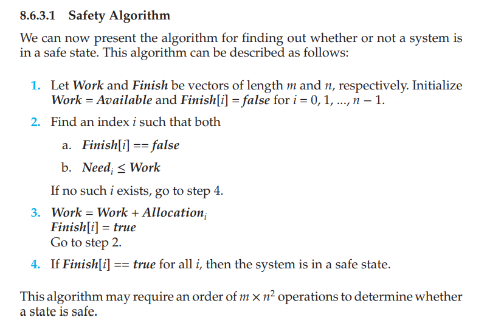
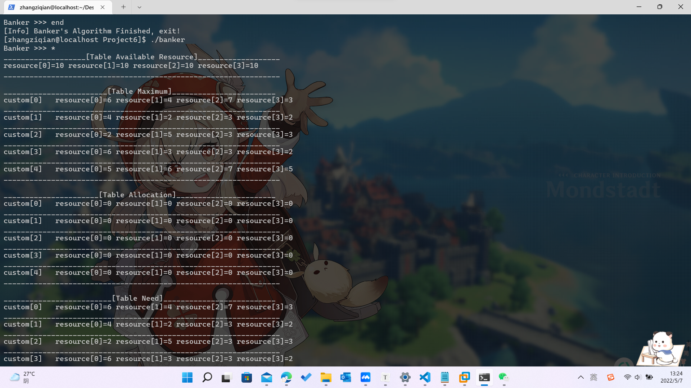
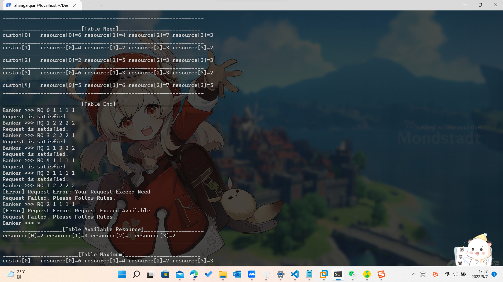

### Project 06 银行家算法

[TOC]


#### 一、项目介绍

对于这个项目，你将编写一个程序来实现第 8.6.3 节中讨论的银行家算法。 客户向银行请求和释放资源。 只有当系统处于安全状态时，银行家才会批准请求。 使系统处于不安全状态的请求将被拒绝。 尽管描述此项目的代码示例以 C 语言说明，但也可以使用 Java 开发解决方案。

资源分配图算法不适用于每种资源类型有多个实例的资源分配系统。我们接下来描述的死锁避免算法适用于这样的系统，但效率低于资源分配图方案。这种算法通常被称为银行家算法。之所以选择这个名称，是因为该算法可以在银行系统中使用，以确保银行永远不会以无法再满足所有客户需求的方式分配其可用现金。当一个新线程进入系统时，它必须声明它可能需要的每种资源类型的最大实例数。此数量不得超过系统中资源的总数。当用户请求一组资源时，系统必须确定这些资源的分配是否会使系统处于安全状态。如果可以，则分配资源；否则，线程必须等到其他线程释放足够的资源。必须维护几个数据结构来实现银行家的算法。这些数据结构对资源分配系统的状态进行编码。

#### 二、算法介绍

根据我们所学的内容，银行家算法中有几个重要的参数：

- Allocation 对于进程目前已经分配的资源表
- Max，对于进程，执行完成所需要最大的资源数目
- Available 可以获得的资源的数目
- Need：用Max减去Allocation的对应条目，得到每个进程执行完还需要的资源的数目

在回顾了我们的之前所学的概念后，我们来开始用银行家算法解决问题：

- 首先，我们要计算出各个进程所需要的资源数目
- 然后我们要计算出当前Available的资源数目
- 我们再拿着可获得的资源数目，和每个进程Need的资源比较一下
- 一旦可以执行，我们就修改Available的资源数目。也就是说Available的资源要增加，增加上之前刚刚执行完成的进程的Allocation表，即可
- 这样一直进行下去，就可以得到一个序列，按照这个序列可以按顺序执行完成任务，不会死锁。


#### 三、实现原理

##### 1、数据读取

- 首先我们要能够根据要求，完成基本的数据读取工作。

- 根据教材的要求，我们在主函数的一开始就完成了数据的写入，例如 maximum 的数组，以及 available 的数组
- 考虑到文件的格式，所以中间的分隔符是 `,`， 所以要调用 strsep的库函数帮助完成分隔，同时转化为整数

```
    // initialize array MAXIMUM with txt file
    FILE *in;
    in = fopen("max_need.txt", "r");
    char customer[SIZE];
    char *temp;
    for(int i=0;i<NUMBER_OF_CUSTOMERS;++i)
    {
        fgets(customer,SIZE,in);
        temp = strdup(customer);
        for(int j=0;j<NUMBER_OF_RESOURCES;j++)
            maximum[i][j]=need[i][j]=atoi(strsep(&temp, ",")), allocation[i][j]=0;
    }
    fclose(in);

    // initialize array **available**  with txt file
    in = fopen("available_resource.txt", "r");
    char ava[SIZE];
    fgets(ava, SIZE, in);
    temp = strdup(ava);
    for(int i=0;i<NUMBER_OF_RESOURCES;i++)
        available[i]=atoi(strsep(&temp, ","));
    fclose(in);
```


##### 2、口令识别

- 为了整个程序能够正常的运行下去，也能正常的退出，根据教材制定了下面的运行逻辑。
  - 如果输入end，就表示退出
  - 如果输入 RQ，就表示请求资源，当然后面要跟上一定的参数
  - 如果输入 RL，就表示释放资源，当然也要跟上一定的参数
  - 如果输入的是非法的命令，那么也会提示报错信息。
- 简要的运行逻辑可以参见下面的代码逻辑，

```
 	while(ifrun)
    {
        printf("Banker >>> ");
        fgets(input_line, SIZE, stdin);

        if(strcmp(input_line, "end\n")==0)
        {
            ifrun = 0;
            printf("[Info] Banker's Algorithm Finished, exit!\n");
            continue;
        }

        if(input_line[0] == 'R' && input_line[1] == 'Q'){
            //decode instruction
            temp = strdup(input_line);
            strsep(&temp," ");
            for(int i=0; i<=NUMBER_OF_RESOURCES;++i)
                input_instruction[i] = atoi(strsep(&temp, " "));
            request_value = request(input_instruction);
            if(request_value!=0)
                printf("Request Failed. Please Follow Rules.\n");
            continue;
        }

        else if(input_line[0] == 'R' && input_line[1] == 'L'){
            temp = strdup(input_line);
            strsep(&temp," ");
            for(int i=0; i<=NUMBER_OF_RESOURCES;++i)
                input_instruction[i] = atoi(strsep(&temp, " "));
            release_value = release(input_instruction);
            if(release_value!=0)
                printf("Release Failed. Please Follow Rules.\n");
            continue;
        }

        else if(input_line[0]=='*')
            state_display();
        else{
            printf("[Error] Invalid Token, Please Input Again!\n");
        }

    }
```


##### 3、核心算法一 资源请求

- 在处理用户的请求的时候，首先要校验用户的输入是否是合理的请求，下面的请求会被直接拒绝不被执行
  - 用户请求的客户端不在我们已有的数据范围之内
  - 用户请求的资源过多，超过了我们已有的资源数量
  - 用户请求的资源超过了自己所需要的资源NEED。
  - 用户请求的资源假设分配之后，会带来死锁的问题。
- 为了能解决死锁的问题，也就是说，我们要模拟一个状态，这个状态是假设分配了这个资源，再来检查这个状态会不会死锁，如果在这种情况之下，出现了死锁，那么我们不能分配，反正就可以分配
- 具体说来，检查这个是否会死锁的函数是 `int safety_algorithm(int *a)` ，这个函数是核心。请看第四部分介绍。
- 当然，如果所有的检查都直接通过了，那么我们就会处理资源分配，具体说来
  - available的资源要减少，进行赋值修改。
  - need数组中，相关的需求也要减少。
  -  allocation中，已经分配的资源要增加。

```c
int requestBasicCheck(int *a){
    int client_id = a[0];
    if(client_id>=NUMBER_OF_CUSTOMERS)
    {
        printf("[Error] Request Error: The ID YOU INPUT Exceed THE NUMBER_OF_CUSTOMERS\n");
        return -1;
    }
    // basic check
    for(int i=1;i<=NUMBER_OF_RESOURCES;++i)
    {
        if(a[i]>need[client_id][i-1])
        {
            printf("[Error] Request Error: Your Request Exceed Need\n");
            return -1;
        }
        if(a[i]>available[i-1])
        {
            printf("[Error] Request Error: Request Exceed Available\n");
            return -1;
        }
    }
    return 0;
}
/* request resource*/
int request(int *a)
{
    int client_id = a[0];
    if (requestBasicCheck(a) == -1)
        return -1;
    /* safety algorithm*/
    int is_safe = safety_algorithm(a);
    if(is_safe == -1)
    {
        printf("[Error] Your Request Leads to An Unsafe State! System Denyed!\n");
        return 1;
    }
    else
    {
        printf("Request is satisfied.\n");
    }
    // after the request, the state should be safe.
    for(int i=1;i<=NUMBER_OF_RESOURCES;++i)
    {
        available[i-1] -= a[i];
        need[client_id][i-1] -= a[i];
        allocation[client_id][i-1] += a[i];
    }
    return 0;
}
```


##### 4、核心算法二 银行家算法

- 首先我们来看教材的图片，我们严格遵守教材的算法过程。



- 按照教材的过程，我们需要这么几个数组
  - Work数组，这个数组初始化为 Available数组，这是因为直接操作Available数组会很危险。
  - 然后，在步骤2中，我们会不断寻找一个任务，这个任务满足两个条件，一是没有执行，也就是说Finish的值是false，同时，这个任务的需求值，在我们可以接收范围内。也就是，这个任务请求的资源不会超过我们已有的资源池。
  - 如果我们发现了一个任务，满足上面的这些条件，我们就可以直接执行了，执行后，需要对于 Work数组增加，因为执行后，已经被分配的资源都被释放了，也就是我们已有的资源（用Work数组记录），同时也要给标记上已经完成。
  - 这样执行之后，我们再去找下一轮可以执行的任务。直到找不到任务执行了。
- 这个时候就要检查，是否所有的任务都已经执行了，如果有任务没有执行，那就说明已经出现了死锁，反之，如果都执行了，这就说明这个状态不会出现死锁，是一个安全状态。
- 严格遵循我们的课本的逻辑，完成了下面代码：
  - 在完成的过程中，值得注意的是：我们是在模拟一些下一个步骤的状态，也就是说我们在检查下一个步骤会不会出现死锁，所以与课本的内容也不完全的是一样的，要做一个适度的修改。
  - 预测下一个状态：`need[a[0]][j](0<=j<资源数)将会变成need[a[0]][j]-a[j+1]`
  - `available[i]会变成 available[i]-a[i+1];`
  - 由于need数组针对不同的行，在未来可能的情况不一样，所以分别考虑。假如我们当前检查的行数，是我们要请求资源分配的行数，need数组未来会变成need[i][j]-a[j+1]

```c

int safety_algorithm(int *a)
{
    // 首先，这一步我们要执行的是一个预测操作
    // 假设这一个操作执行成功了，我们要检查是否会出现死锁
    // 如果这个操作执行成功了，need[a[0]][j](0<=j<资源数)将会变成need[a[0]][j]-a[j+1]
    // 同样的，假如这个步骤执行成功了， available[i]会变成 available[i]-a[i+1];
    // 你可能会问为什么是i+1，这是由于a[]系列的数组第第一个a[0]元素是表示customer的编号，所以有一个错位

    // 所以按照教材，我们要定义一个数组，work数组最开始初始化为available数组，也就是假定操作成功后的available
    // 假如这个步骤执行成功了， available[i]会变成 available[i]-a[i+1];
    int work[NUMBER_OF_RESOURCES];
    for(int i=0; i<NUMBER_OF_RESOURCES; i++)
        work[i] = available[i]-a[i+1];

    // 然后我们要定义一个finish的数组，表示是否可以完成的任务，初始化为不能完成
    int finish[NUMBER_OF_CUSTOMERS];
    for(int i=0; i<NUMBER_OF_CUSTOMERS; ++i)
        finish[i]=0;

    int all_satisfy;
    int i;
    for(i=0; i<NUMBER_OF_CUSTOMERS; ++i)
    {
        all_satisfy=0;//refresh

        if(finish[i]==0){
            for(int j=0; j<NUMBER_OF_RESOURCES; ++j)
            {
                // 由于need数组针对不同的行，在未来可能的情况不一样，所以分别考虑
                // 假如我们当前检查的行数，是我们要请求资源分配的行数，need数组未来会变成need[i][j]-a[j+1]
                // 反之不会变的
                if(i==a[0])
                {
                    if(need[i][j]-a[j+1]<=work[j])
                        all_satisfy++;
                }
                else if(need[i][j]<=work[j])
                    all_satisfy++;
            }
            if(all_satisfy==NUMBER_OF_RESOURCES)
            {   //this customer can be finished
                for(int j=0; j<NUMBER_OF_RESOURCES; ++j)
                    work[j] += allocation[i][j];
                finish[i]=1;
                i=-1;// back to the start
            }
        }
    }

    int satisfy_number = 0;
    for(i=0; i<NUMBER_OF_CUSTOMERS; ++i){
        if(finish[i]==1)
            satisfy_number++;
        else{
            printf("[Error] DeadLock Detected! If you do such a request, in next status,Task %d won't be executed \n", i);
        }
    }
    if(satisfy_number == NUMBER_OF_CUSTOMERS)
        return 0;   //safe
    else
        return -1;  //unsafe
}

```


##### 5、核心算法三 资源释放

- 对于用户请求的资源释放，我们也要类似资源请求的处理一样。
  - 首先我们要检查用户的请求参数是否合法，也要调用一个函数  `int releaseBasicCheck(int *a)` 检查是否可以执行。
  - 用户要释放的客户端不在我们已有的数据范围之内
  - 用户释放的资源过多，超过了已经请求的资源。
  - 当然，释放资源是不会带来死锁的，所以这一点不同于之前，可以不用考虑。

```c

int releaseBasicCheck(int *a){
    int consumer_id = a[0];
    if(consumer_id >= NUMBER_OF_CUSTOMERS)
    {
        printf("[Error] Request Error: Your Request Release Exceed Need\n");
        return -1;
    }
    // basic check
    for(int i=1;i<=NUMBER_OF_RESOURCES;++i)
    {
        if(a[i]>allocation[consumer_id][i-1])
        {
            printf("[Error] Release Error: Release Exceed Allocation\n");
            return -1;
        }
    }
    return 0;
}


/* release resource*/
int release(int *a)
{
    int consumer_id = a[0];
    if(releaseBasicCheck(a) == -1)
        return -1;
    // no exceed
    for(int i=1;i<=NUMBER_OF_RESOURCES; ++i)
    {
        allocation[consumer_id][i-1] -= a[i];
    }
    return 0;
}
```


##### 6、源代码展示

```c
#include <stdio.h>
#include <stdlib.h>
#include <string.h>
#define NUMBER_OF_CUSTOMERS 5
#define NUMBER_OF_RESOURCES 4
#define SIZE 100
/* the available amount of each resource */
int available[NUMBER_OF_RESOURCES];
/*the maximum demand of each customer */
int maximum[NUMBER_OF_CUSTOMERS][NUMBER_OF_RESOURCES];
/* the amount currently allocated to each customer */
int allocation[NUMBER_OF_CUSTOMERS][NUMBER_OF_RESOURCES];
/* the remaining need of each customer */
int need[NUMBER_OF_CUSTOMERS][NUMBER_OF_RESOURCES];

int requestBasicCheck(int *a){
    int client_id = a[0];
    if(client_id>=NUMBER_OF_CUSTOMERS)
    {
        printf("[Error] Request Error: The ID YOU INPUT Exceed THE NUMBER_OF_CUSTOMERS\n");
        return -1;
    }
    // basic check
    for(int i=1;i<=NUMBER_OF_RESOURCES;++i)
    {
        if(a[i]>need[client_id][i-1])
        {
            printf("[Error] Request Error: Your Request Exceed Need\n");
            return -1;
        }
        if(a[i]>available[i-1])
        {
            printf("[Error] Request Error: Request Exceed Available\n");
            return -1;
        }
    }
    return 0;
}


/* request resource*/
int request(int *a)
{
    int client_id = a[0];
    if (requestBasicCheck(a) == -1)
        return -1;
    /* safety algorithm*/
    int is_safe = safety_algorithm(a);
    if(is_safe == -1)
    {
        printf("[Error] Your Request Leads to An Unsafe State! System Denyed!\n");
        return 1;
    }
    else
    {
        printf("Request is satisfied.\n");
    }
    // after the request, the state should be safe.
    for(int i=1;i<=NUMBER_OF_RESOURCES;++i)
    {
        available[i-1] -= a[i];
        need[client_id][i-1] -= a[i];
        allocation[client_id][i-1] += a[i];
    }
    return 0;
}

int releaseBasicCheck(int *a){
    int consumer_id = a[0];
    if(consumer_id >= NUMBER_OF_CUSTOMERS)
    {
        printf("[Error] Request Error: Your Request Release Exceed Need\n");
        return -1;
    }
    // basic check
    for(int i=1;i<=NUMBER_OF_RESOURCES;++i)
    {
        if(a[i]>allocation[consumer_id][i-1])
        {
            printf("[Error] Release Error: Release Exceed Allocation\n");
            return -1;
        }
    }
    return 0;
}


/* release resource*/
int release(int *a)
{
    int consumer_id = a[0];
    if(releaseBasicCheck(a) == -1)
        return -1;
    // no exceed
    for(int i=1;i<=NUMBER_OF_RESOURCES; ++i)
    {
        allocation[consumer_id][i-1] -= a[i];
    }
    return 0;
}


/* show all the states*/
void state_display()
{
    int i;
    int j;
    printf("___________________[Table Available Resource]___________________\n");
    for(i=0;i<NUMBER_OF_RESOURCES;++i)
        printf("resource[%d]=%d ", i, available[i]);
    printf("\n________________________________________________________________");
    printf("\n\n");

    printf("________________________[Table Maximum]________________________\n");
    for(i=0;i<NUMBER_OF_CUSTOMERS;++i)
    {
        printf("custom[%d]   ", i);
        for(j=0;j<NUMBER_OF_RESOURCES;++j)
            printf("resource[%d]=%d ", j, maximum[i][j]);
        printf("\n________________________________________________________________");
        printf("\n");
    }
    printf("\n");

    printf("______________________[Table Allocation]_______________________\n");
    for(i=0;i<NUMBER_OF_CUSTOMERS;++i)
    {
        printf("custom[%d]   ", i);
        for(j=0;j<NUMBER_OF_RESOURCES;++j)
            printf("resource[%d]=%d ", j, allocation[i][j]);
        printf("\n________________________________________________________________");
        printf("\n");
    }
    printf("\n");

    printf("_________________________[Table Need]__________________________\n");
    for(i=0;i<NUMBER_OF_CUSTOMERS;++i)
    {
        printf("custom[%d]   ", i);
        for(j=0;j<NUMBER_OF_RESOURCES;++j)
            printf("resource[%d]=%d ", j, need[i][j]);
        printf("\n________________________________________________________________");
        printf("\n");
    }
    printf("\n");
    printf("_________________________[Table End]__________________________\n");
}


int safety_algorithm(int *a)
{
    // 首先，这一步我们要执行的是一个预测操作
    // 假设这一个操作执行成功了，我们要检查是否会出现死锁
    // 如果这个操作执行成功了，need[a[0]][j](0<=j<资源数)将会变成need[a[0]][j]-a[j+1]
    // 同样的，假如这个步骤执行成功了， available[i]会变成 available[i]-a[i+1];
    // 你可能会问为什么是i+1，这是由于a[]系列的数组第第一个a[0]元素是表示customer的编号，所以有一个错位

    // 所以按照教材，我们要定义一个数组，work数组最开始初始化为available数组，也就是假定操作成功后的available
    // 假如这个步骤执行成功了， available[i]会变成 available[i]-a[i+1];
    int work[NUMBER_OF_RESOURCES];
    for(int i=0; i<NUMBER_OF_RESOURCES; i++)
        work[i] = available[i]-a[i+1];

    // 然后我们要定义一个finish的数组，表示是否可以完成的任务，初始化为不能完成
    int finish[NUMBER_OF_CUSTOMERS];
    for(int i=0; i<NUMBER_OF_CUSTOMERS; ++i)
        finish[i]=0;

    int all_satisfy;
    int i;
    for(i=0; i<NUMBER_OF_CUSTOMERS; ++i)
    {
        all_satisfy=0;//refresh

        if(finish[i]==0){
            for(int j=0; j<NUMBER_OF_RESOURCES; ++j)
            {
                // 由于need数组针对不同的行，在未来可能的情况不一样，所以分别考虑
                // 假如我们当前检查的行数，是我们要请求资源分配的行数，need数组未来会变成need[i][j]-a[j+1]
                // 反之不会变的
                if(i==a[0])
                {
                    if(need[i][j]-a[j+1]<=work[j])
                        all_satisfy++;
                }
                else if(need[i][j]<=work[j])
                    all_satisfy++;
            }
            if(all_satisfy==NUMBER_OF_RESOURCES)
            {   //this customer can be finished
                for(int j=0; j<NUMBER_OF_RESOURCES; ++j)
                    work[j] += allocation[i][j];
                finish[i]=1;
                i=-1;// back to the start
            }
        }
    }

    int satisfy_number = 0;
    for(i=0; i<NUMBER_OF_CUSTOMERS; ++i){
        if(finish[i]==1)
            satisfy_number++;
        else{
            printf("[Error] DeadLock Detected! If you do such a request, in next status,Task %d won't be executed \n", i);
        }
    }
    if(satisfy_number == NUMBER_OF_CUSTOMERS)
        return 0;   //safe
    else
        return -1;  //unsafe
}


int main()
{
    // initialize array MAXIMUM with txt file
    FILE *in;
    in = fopen("max_need.txt", "r");
    char customer[SIZE];
    char *temp;
    for(int i=0;i<NUMBER_OF_CUSTOMERS;++i)
    {
        fgets(customer,SIZE,in);
        temp = strdup(customer);
        for(int j=0;j<NUMBER_OF_RESOURCES;j++)
            maximum[i][j]=need[i][j]=atoi(strsep(&temp, ",")), allocation[i][j]=0;
    }
    fclose(in);

    // initialize array **available**  with txt file
    in = fopen("available_resource.txt", "r");
    char ava[SIZE];
    fgets(ava, SIZE, in);
    temp = strdup(ava);
    for(int i=0;i<NUMBER_OF_RESOURCES;i++)
        available[i]=atoi(strsep(&temp, ","));
    fclose(in);


    int input_instruction[NUMBER_OF_RESOURCES+1];
    int request_value;
    int release_value;
    int tmp;

    char input_line[SIZE];
    int ifrun = 1;
    while(ifrun)
    {
        printf("Banker >>> ");
        fgets(input_line, SIZE, stdin);

        if(strcmp(input_line, "end\n")==0)
        {
            ifrun = 0;
            printf("[Info] Banker's Algorithm Finished, exit!\n");
            continue;
        }

        if(input_line[0] == 'R' && input_line[1] == 'Q'){
            //decode instruction
            temp = strdup(input_line);
            strsep(&temp," ");
            for(int i=0; i<=NUMBER_OF_RESOURCES;++i)
                input_instruction[i] = atoi(strsep(&temp, " "));
            request_value = request(input_instruction);
            if(request_value!=0)
                printf("Request Failed. Please Follow Rules.\n");
            continue;
        }

        else if(input_line[0] == 'R' && input_line[1] == 'L'){
            temp = strdup(input_line);
            strsep(&temp," ");
            for(int i=0; i<=NUMBER_OF_RESOURCES;++i)
                input_instruction[i] = atoi(strsep(&temp, " "));
            release_value = release(input_instruction);
            if(release_value!=0)
                printf("Release Failed. Please Follow Rules.\n");
            continue;
        }

        else if(input_line[0]=='*')
            state_display();
        else{
            printf("[Error] Invalid Token, Please Input Again!\n");
        }

    }
    return 0;
}
```


#### 四、效果演示

- 能够打印出状态的表格。



- 能够请求资源，并根据实际情况提示报错信息。

