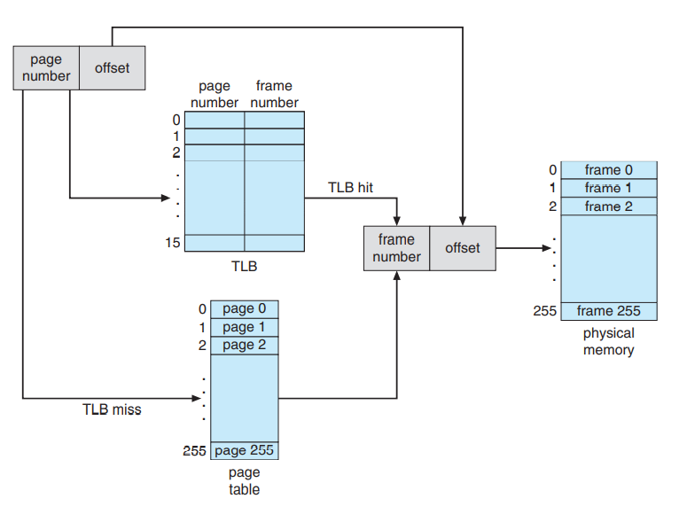
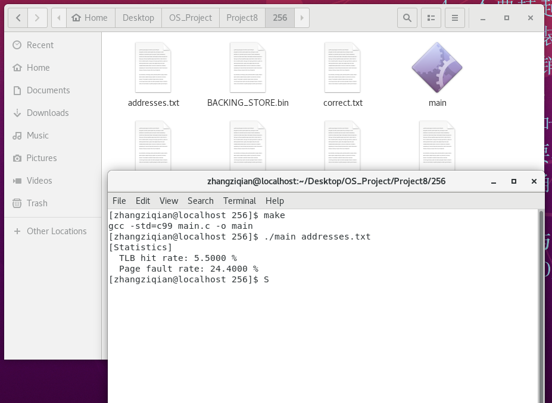
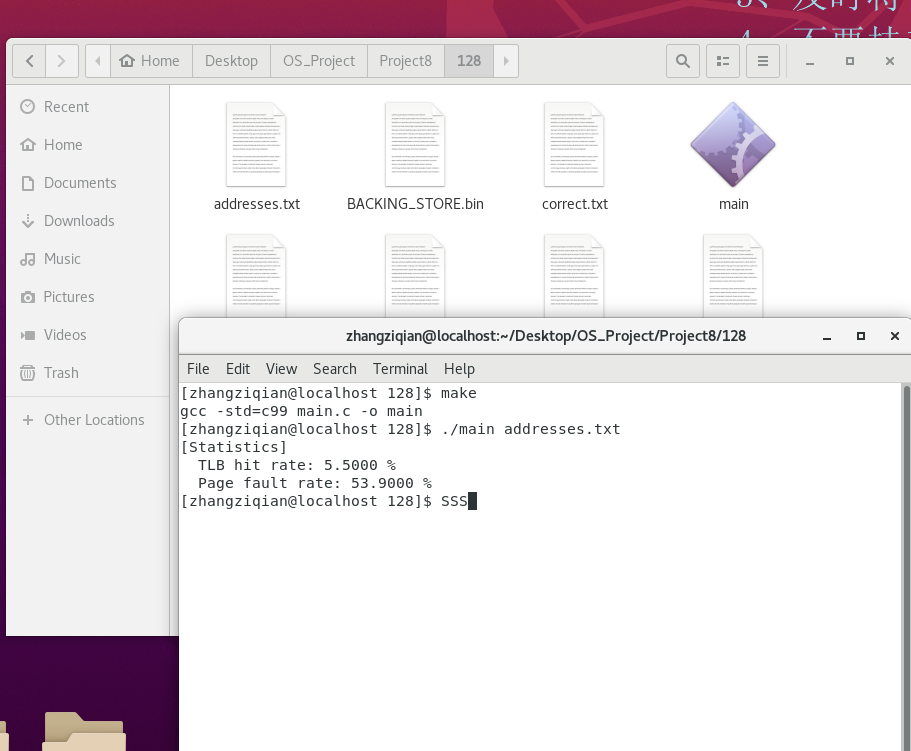
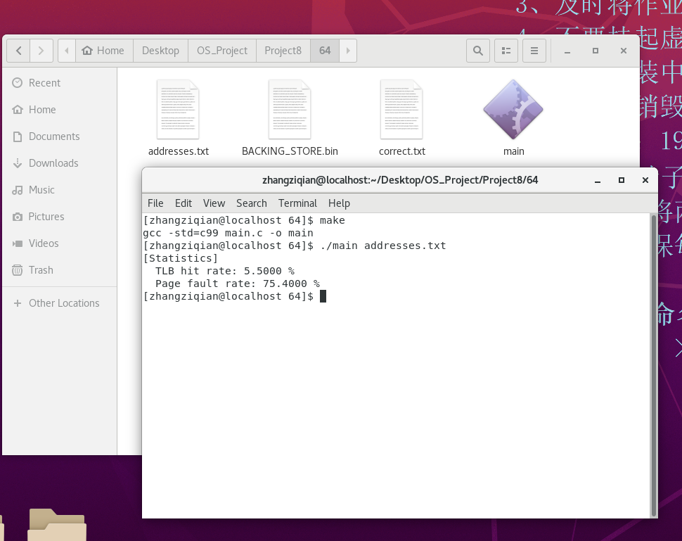
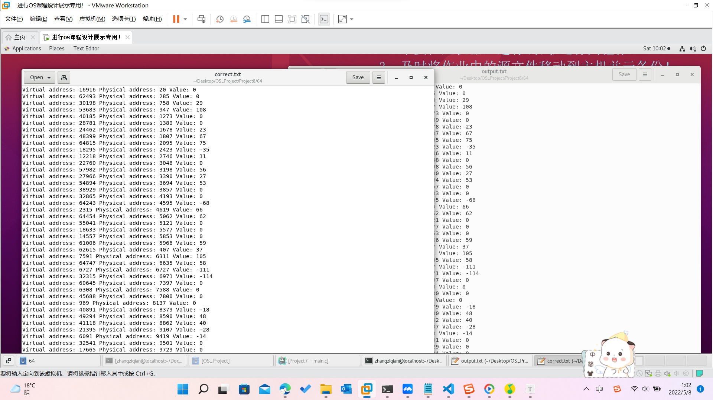

### Project 8 虚拟内存

[TOC]

#### 一、项目简介

##### 1、实验目标

该项目包括编写一个程序，该程序将逻辑地址转换为物理地址，用于大小为 $2^16 = 65 536 $字节的虚拟地址空间。 程序将从包含逻辑地址的文件中读取，并使用 TLB 和页表将每个逻辑地址转换为其相应的物理地址，并输出存储在转换后的物理地址处的字节的值。学习目标是使用模拟来理解将逻辑地址转换为物理地址所涉及的步骤。 这将包括使用请求分页解决页面错误、管理 TLB 和实现页面替换算法。

##### 2、实验参数

- $2^8$ 的页表的条目
- $2^8$ 的页的大小
- 16个条目在TLB中
-  $2^8$的框的数目
- 65536byte的物理内存大小($256 frames \times 256-byte \;frames \; size $)

##### 3、实现要求

此外，您的程序只需要关心读取逻辑地址并将它们转换为相应的物理地址。 您不需要支持写入逻辑地址空间。

##### 4、逻辑原理图

程序将使用第 9.3 节中概述的 TLB 和页表将逻辑地址转换为物理地址。 首先，从逻辑地址中提取页码，并查阅TLB。 在 TLB 命中的情况下，从 TLB 中获取帧号。 在 TLB 未命中的情况下，必须查阅页表。 在后一种情况下，要么从页表中获取帧号，要么发生页面错误。 地址转换过程的可视化表示是：




##### 5、处理页错误

您的程序将按照第 10.2 节中的说明实现需求分页。 后备存储由文件 BACKING STORE.bin 表示，这是一个大小为 65,536 字节的二进制文件。 当发生页面错误时，您将从文件 BACKING STORE 中读取一个 256 字节的页面，并将其存储在物理内存中的可用页面框架中。 例如，如果页码为 15 的逻辑地址导致页错误，您的程序将从 BACKING STORE 读取第 15 页（请记住，页从 0 开始，大小为 256 字节）并将其存储在页框中 在物理内存中。 一旦这个帧被存储（并且页表和 TLB 被更新），随后对第 15 页的访问将由 TLB 或页表解析。

我们需要将 `BACKING STORE.bin` 视为随机访问文件，以便您可以随机查找文件的某些位置进行读取。 使用标准 C 库函数来执行 I/O，包括 `fopen()`、`fread()`、`fseek()` 和 `fclose()`。

物理内存的大小与虚拟地址空间的大小相同（65,536 字节），因此无需担心页面错误期间的页面替换。 稍后，我们将使用更少量的物理内存描述对这个项目的修改； 此时，将需要页面替换策略


#### 二、具体实现

##### 1、主函数核心

- 主函数完成整个流程的接管，首先要检查输入的参数数目是否足够，如果异常的话直接退出。
- 然后，主函数将会打开输入的文件，打开输出的文件，并且准备写入。
- 然后要进行初始化，初始化页表、初始化TLB、以及初始化内存（这里会创建很多个空的框架，等待后期的数据写入）
- 之后，我们按照行数来读取，每次读取一个地址整数 $inputAddr$ ，然后根据这个整数来计算地址和偏移量
  - 地址：`地址 = inputAddr & 0x0000ffff ​ `
  - 偏移量：`offset = addr & 0x000000ff;`
  - 数值 res
- 最后我们要负责这些数值的输出，以便于和标准的答案作对照。

```c
int main(int argc, char *argv[]) {	
	if (argc != 2) {
		fprintf(stderr, "[Err] Invalid input!\n");
		return 1;
	}

	FILE *fp_in = fopen(argv[1], "r");
	if(fp_in == NULL) {
		fprintf(stderr, "[Err] Input File Error!\n");
		return 1;
	}
	
	FILE *fp_out = fopen("output.txt", "w");
	if (fp_out == NULL) {
		fprintf(stderr, "[Err] Out File Error!\n");
		return 1;
	}

	initialize();
		
	int addr, page_num, offset, frame_num, res, cnt = 0;
	while(~fscanf(fp_in, "%d", &addr)) {
		++ cnt;
		addr = addr & 0x0000ffff;
		offset = addr & 0x000000ff;
		page_num = (addr >> 8) & 0x000000ff;
		frame_num = get_frame_num(page_num);
		res = (int) access_memory(frame_num, offset);
		fprintf(fp_out, "Virtual address: %d Physical address: %d Value: %d\n", addr, (frame_num << 8) + offset, res);
	}
	
	fprintf(stdout, "[Statistics]\n  TLB hit rate: %.4f %%\n  Page fault rate: %.4f %%\n", 100.0 * TLB_hit_count / cnt, 100.0 * page_fault_count / cnt);
	
	clean();
	fclose(fp_in);
	fclose(fp_out);
	return 0;
}
```


##### 2、 核心函数：获取框架编号

 `get_frame_num(page_num);`

- 这个函数传入的产生是页号，根据页号去寻找对应的框架编号。
- 首先第一步就是要检查这个页号的合法性，超过范围的非法直接返回错误
- 然后我们要尝试通过TLB的方法来获取页号，如果获取失败，我们就继续，如果获取成功了，我们就直接返回答案。
- 正如上面所说，如果获取失败，我们就去 vi_page_table 中去寻找，如果找到了，我们就顺手更新一下TLB中的表值，然后返回函数。
- 反之，就出现页错误！这个时候要统计页的错误数量，同时，我们要把这个页添加到内存，当然我们是从那个二进制的文件中读取数据。

```c
int get_frame_num(int page_num) {
	if (page_num < 0 || page_num >= PAGE_NUM) return -1;
	
	int TLB_res = get_TLB_frame_num(page_num);
	if (TLB_res != -1) return TLB_res;

	if (vi_page_table[page_num] == 1) {
		update_TLB(page_num, page_table[page_num]);
		return page_table[page_num];
	} else {
		// Page fault.
		++ page_fault_count;
		page_table[page_num] = add_page_into_memory(page_num);
		vi_page_table[page_num] = 1;
		update_TLB(page_num, page_table[page_num]);
		return page_table[page_num];
	}
}
```


##### 3、从二进制文件读取数据

`add_page_into_memory()` 函数

- 这一部分涉及到从那个二进制的文件中读取一些数据，这个数据也会作为后期用来检查数据是否正确的依据。
- 这个步骤首先要读取二进制文件。通过页号，把数据读取到缓冲区中。
- get_empty_frame();可以获取一个新的页，然后我们根据这个页的编号来写入数据。
- 写入数据会写入到memory的数组中的。

```c
int get_empty_frame() {
	if (head == NULL && tail == NULL) return -1;

	int frame_num;
	if (head == tail) {
		frame_num = head -> frame_num;
		free(head);
		head = tail = NULL;
		return frame_num;
	}

	struct empty_frame_list_node *tmp;	
	frame_num = head -> frame_num;
	tmp = head;
	head = head -> nxt;
	free(tmp);
	return frame_num;
}
int add_page_into_memory(int page_num) {
	fseek(fp_backing_store, page_num * FRAME_SIZE, SEEK_SET);
    fread(buf, sizeof(char), FRAME_SIZE, fp_backing_store);
	
	int frame_num = get_empty_frame();
	if (frame_num == -1) {
		// LRU replacement.
		for (int i = 0; i < FRAME_NUM; ++ i)
			if (frame_LRU[i] == FRAME_NUM) {
				frame_num = i;
				break;
			}
		delete_page_table_item(frame_num);
	}

	for (int i = 0; i < FRAME_SIZE; ++ i)
		memory[frame_num * FRAME_SIZE + i] = buf[i];
	for (int i = 0; i < FRAME_NUM; ++ i)
		if (frame_LRU[i] > 0) ++ frame_LRU[i];
	frame_LRU[frame_num] = 1;
	return frame_num;
}
```


##### 4、更新缓存的条目

- 这个函数是用来更新缓存中的条目的。
- 首先我们定义了一个pos的变量，这个变量将会去寻找一个合适的位置，然后后面更新的将会是这个位置的条目。
- 如果这个位置是一个没有使用的部分的元素就直接pos = i;，赋值结束
- 如果这个位置无法找到，我们就直接定位到最后的一个元素，将其更新。

```c
// Update TLB entry
void update_TLB(int page_num, int frame_num) {
	int pos = -1;
	for (int i = 0; i < TLB_SIZE; ++ i)
		if(TLB_LRU[i] == 0) {
			pos = i;
			break;
		}
	
	if (pos == -1) {
		// LRU replacement.
		for (int i = 0; i < TLB_SIZE; ++ i)
			if(TLB_LRU[i] == TLB_SIZE) {
				pos = i;
				break;
			}
	}
	
	TLB_page[pos] = page_num;
	TLB_frame[pos] = frame_num;
	for (int i = 0; i < TLB_SIZE; ++ i)
		if (TLB_LRU[i] > 0) ++ TLB_LRU[i];
	TLB_LRU[pos] = 1;
}
```


#### 三、实验演示

##### 1、对比检查

- frame_num 的数量改变对于错误率的影响
- 下面展示的结果依次是256、128、64的框架数目，可以看到，命中率是基本没有改变的，改变的是页面的错误率，并且frame_num1的数量越小，出现错误的概率越大。







##### 2、数据检查

- 我们对比了标准的答案，可以发现，两者的内容是完全一模一样的！




#### 四、实验的原代码

```c
# include <stdio.h>
# include <stdlib.h>
# include <string.h>

# define PAGE_NUM 256
# define PAGE_SIZE 256
# define FRAME_NUM 128
# define FRAME_SIZE 256
# define TLB_SIZE 16

// ================= Empty Frame List ================== //
struct empty_frame_list_node {
	int frame_num;
	struct empty_frame_list_node *nxt;
};

struct empty_frame_list_node *head = NULL;
struct empty_frame_list_node *tail = NULL;

// Add the empty frame to the empty frame list.
void add_empty_frame(int frame_num) {
	if (head == NULL && tail == NULL) {
		tail = (struct empty_frame_list_node *) malloc (sizeof(struct empty_frame_list_node));
		tail -> frame_num = frame_num;
		tail -> nxt = NULL;
		head = tail;
	} else {
		tail -> nxt = (struct empty_frame_list_node *) malloc (sizeof(struct empty_frame_list_node));
		tail -> nxt -> frame_num = frame_num;
		tail -> nxt -> nxt = NULL;
		tail = tail -> nxt;
	}
}

// Get an empty frame from the empty frame list.
// If success, return frame_num; otherwise, return -1.
int get_empty_frame() {
	if (head == NULL && tail == NULL) return -1;

	int frame_num;
	if (head == tail) {
		frame_num = head -> frame_num;
		free(head);
		head = tail = NULL;
		return frame_num;
	}

	struct empty_frame_list_node *tmp;	
	frame_num = head -> frame_num;
	tmp = head;
	head = head -> nxt;
	free(tmp);
	return frame_num;
}

// Initialize the empty frame list.
void initialize_empty_frame_list() {
	for (int i = 0; i < FRAME_NUM; ++ i)
		add_empty_frame(i);
}

// Clean the empty frame list.
void clean_empty_frame_list() {
	if (head == NULL && tail == NULL) return;
	struct empty_frame_list_node *tmp;
	while (head != tail) {
		tmp = head;
		head = head -> nxt;
		free(tmp);
	}
	free(head);
	head = tail = NULL;
}
// ============== End of Empty Frame List ============== //


// ====================== Memory ======================= //
char memory[FRAME_NUM * FRAME_SIZE];
int frame_LRU[FRAME_NUM];
char buf[FRAME_SIZE];
FILE *fp_backing_store;

void initialize_memory() {
	fp_backing_store = fopen("BACKING_STORE.bin", "rb");
	if (fp_backing_store == NULL) {
		fprintf(stderr, "[Err] Open backing store file error!\n");
		exit(1);
	}
	initialize_empty_frame_list();
	for (int i = 0; i < FRAME_NUM; ++ i)
		frame_LRU[i] = 0;
}

void delete_page_table_item(int frame_num);
int add_page_into_memory(int page_num) {
	fseek(fp_backing_store, page_num * FRAME_SIZE, SEEK_SET);
    fread(buf, sizeof(char), FRAME_SIZE, fp_backing_store);
	
	int frame_num = get_empty_frame();
	if (frame_num == -1) {
		// LRU replacement.
		for (int i = 0; i < FRAME_NUM; ++ i)
			if (frame_LRU[i] == FRAME_NUM) {
				frame_num = i;
				break;
			}
		delete_page_table_item(frame_num);
	}

	for (int i = 0; i < FRAME_SIZE; ++ i)
		memory[frame_num * FRAME_SIZE + i] = buf[i];
	for (int i = 0; i < FRAME_NUM; ++ i)
		if (frame_LRU[i] > 0) ++ frame_LRU[i];
	frame_LRU[frame_num] = 1;
	return frame_num;
}

char access_memory(int frame_num, int offset) {
	char res = memory[frame_num * FRAME_SIZE + offset];
	for (int i = 0; i < FRAME_NUM; ++ i)
		if (frame_LRU[i] > 0 && frame_LRU[i] < frame_LRU[frame_num])
			++ frame_LRU[i];
	frame_LRU[frame_num] = 1;
	return res;
}

void clean_memory() {
	clean_empty_frame_list();
	fclose(fp_backing_store);
}
// =================== End of Memory =================== //


// ======================== TLB ======================== //
int TLB_page[TLB_SIZE], TLB_frame[TLB_SIZE];
int TLB_LRU[TLB_SIZE];
int TLB_hit_count;

void initialize_TLB() {
	TLB_hit_count = 0;
	for (int i = 0; i < TLB_SIZE; ++ i) {
		TLB_page[i] = 0;
		TLB_frame[i] = 0;
		TLB_LRU[i] = 0;
	}
}

//   Get the corresponding frame number from TLB.
//   Return non-negative number for the corresponding frame number;
//   Return -1 for TLB miss.
//   Note: it's needless to check the validation of page_num again.
int get_TLB_frame_num(int page_num) {
	int pos = -1;
	for (int i = 0; i < TLB_SIZE; ++ i)
		if (TLB_LRU[i] > 0 && TLB_page[i] == page_num) {
			pos = i;
			break;
		}

	if (pos == -1) return -1;
	
	// TLB hit.
	++ TLB_hit_count;
	for (int i = 0; i < TLB_SIZE; ++ i)
		if (TLB_LRU[i] > 0 && TLB_LRU[i] < TLB_LRU[pos])
			++ TLB_LRU[i];
	TLB_LRU[pos] = 1;
	return TLB_frame[pos];
}

// Update TLB entry
void update_TLB(int page_num, int frame_num) {
	int pos = -1;
	for (int i = 0; i < TLB_SIZE; ++ i)
		if(TLB_LRU[i] == 0) {
			pos = i;
			break;
		}
	
	if (pos == -1) {
		// LRU replacement.
		for (int i = 0; i < TLB_SIZE; ++ i)
			if(TLB_LRU[i] == TLB_SIZE) {
				pos = i;
				break;
			}
	}
	
	TLB_page[pos] = page_num;
	TLB_frame[pos] = frame_num;
	for (int i = 0; i < TLB_SIZE; ++ i)
		if (TLB_LRU[i] > 0) ++ TLB_LRU[i];
	TLB_LRU[pos] = 1;
}

// Delete TLB item.
void delete_TLB_item(int page_num, int frame_num) {
	int pos = -1;
	for (int i = 0; i < TLB_SIZE; ++ i)
		if(TLB_LRU[i] && TLB_page[i] == page_num && TLB_frame[i] == frame_num) {
			pos = i;
			break;
		}
	
	if (pos == -1) return;
	
	for (int i = 0; i < TLB_SIZE; ++ i)
		if (TLB_LRU[i] > TLB_LRU[pos]) -- TLB_LRU[i];
	TLB_LRU[pos] = 0;
}
// ===================== End of TLB ==================== //


// ==================== Page Table ===================== //
int page_table[PAGE_NUM];
int vi_page_table[PAGE_NUM];  // vi: valid-invalid
int page_fault_count;

void initialize_page_table() {
	page_fault_count = 0;
	for (int i = 0; i < PAGE_NUM; ++ i) {
		page_table[i] = 0;
		vi_page_table[i] = 0;
	}
}

// Get the corresponding frame number.
//   Return non-negative number for the corresponding frame number;
//   Return -1 for invalid page number.
int get_frame_num(int page_num) {
	if (page_num < 0 || page_num >= PAGE_NUM) return -1;
	
	int TLB_res = get_TLB_frame_num(page_num);
	if (TLB_res != -1) return TLB_res;

	if (vi_page_table[page_num] == 1) {
		update_TLB(page_num, page_table[page_num]);
		return page_table[page_num];
	} else {
		// Page fault.
		++ page_fault_count;
		page_table[page_num] = add_page_into_memory(page_num);
		vi_page_table[page_num] = 1;
		update_TLB(page_num, page_table[page_num]);
		return page_table[page_num];
	}
}

// Delete page table item
void delete_page_table_item(int frame_num) {
	int page_num = -1;
	for (int i = 0; i < PAGE_NUM; ++ i)
		if(vi_page_table[i] && page_table[i] == frame_num) {
			page_num = i;
			break;
		}
	if (page_num == -1) {
		fprintf(stderr, "[Err] Unexpected Error!\n");
		exit(1);
	}
	vi_page_table[page_num] = 0;
	delete_TLB_item(page_num, frame_num);
}
// ================= End of Page Table ================= //


void initialize() {
	initialize_page_table();
	initialize_TLB();
	initialize_memory();
}

void clean() {
	clean_memory();
}


int main(int argc, char *argv[]) {	
	if (argc != 2) {
		fprintf(stderr, "[Err] Invalid input!\n");
		return 1;
	}

	FILE *fp_in = fopen(argv[1], "r");
	if(fp_in == NULL) {
		fprintf(stderr, "[Err] Input File Error!\n");
		return 1;
	}
	
	FILE *fp_out = fopen("output.txt", "w");
	if (fp_out == NULL) {
		fprintf(stderr, "[Err] Out File Error!\n");
		return 1;
	}

	initialize();
		
	int addr, page_num, offset, frame_num, res, cnt = 0;
	while(~fscanf(fp_in, "%d", &addr)) {
		++ cnt;
		addr = addr & 0x0000ffff;
		offset = addr & 0x000000ff;
		page_num = (addr >> 8) & 0x000000ff;
		frame_num = get_frame_num(page_num);
		res = (int) access_memory(frame_num, offset);
		fprintf(fp_out, "Virtual address: %d Physical address: %d Value: %d\n", addr, (frame_num << 8) + offset, res);
	}
	
	fprintf(stdout, "[Statistics]\n  TLB hit rate: %.4f %%\n  Page fault rate: %.4f %%\n", 100.0 * TLB_hit_count / cnt, 100.0 * page_fault_count / cnt);
	
	clean();
	fclose(fp_in);
	fclose(fp_out);
	return 0;
}
```


#### 五、实验的收货与归纳

- 第一次的尝试了对于二进制这种的文件的读取，对于这些函数有了进一步的了解 `fopen()`、`fread()`、`fseek()` 和 `fclose()`。
- 此外，我了解了分页在这个项目中是如何工作的，更深入地了解了虚拟地址。 
- 对于虚拟内存的管理算法和方式有了更深层的理解。
- 当然，万变不离其宗，总而言之最核心的算法还是这一张图，概括了一整个章节的知识！


